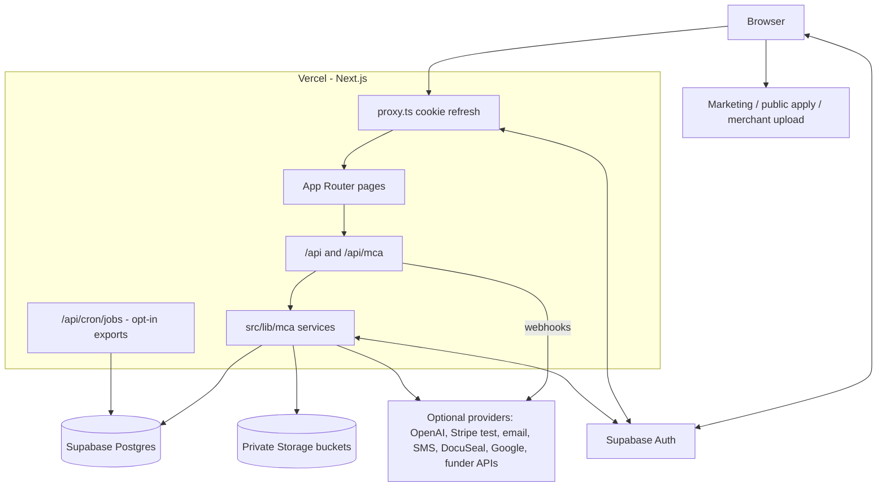
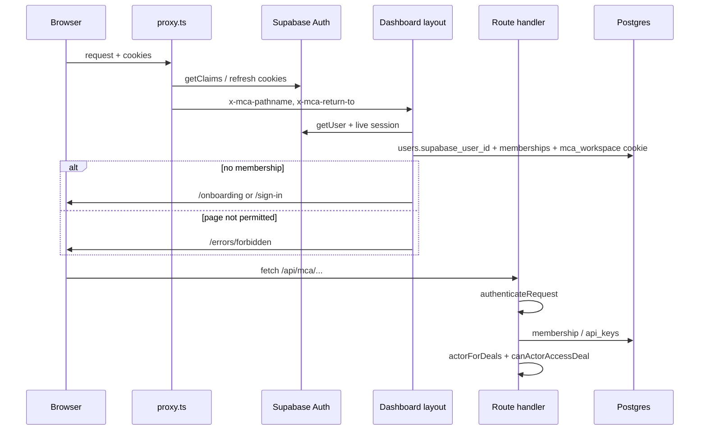

# Fundlane / MCA architecture (for agents)

This is the document of record for how the application is connected. Read it before implementing, reviewing, or debugging. Verify every claim against source; Graphify and older markdown can lag the code.

Product name in the UI and marketing: **Fundlane**. Internal module prefix: **MCA**. GitHub: `mbelenkiy29/fundlane`. Linear project: [MCA](https://linear.app/michael-belenkiy/project/mca-1e94b0617388) (`b223a780-3987-440c-8e04-41516a97e69b`).

Prepared from a source + Graphify scan of this workspace (graph built from commit `60dcbfb9`; working tree may be ahead). Current hosting: Vercel web + Supabase Auth/Postgres/Storage. Clerk, Neon, Railway, and the Render website are not the live application stack.

---

## 0. How to start every task

1. Identify the **domain** from the table in [§8](#8-domain-playbooks-start-here-for-any-feature). Open those files first. Do not search `vite-version/` or root `docs/`.
2. From the workspace root, query the graph, then open the returned source:

   ```bash
   graphify query "<domain keywords>" --budget 1500
   graphify explain "<symbol>"
   graphify path "requireWorkspaceAccess" "<target>"
   ```

3. Confirm **current stack** from this file and `nextjs-version/README.md`. Ignore Clerk/Neon/SQLite/filesystem-as-production instructions unless the task is historical rollback.
4. Follow the [request anatomy](#5-request-anatomy) end to end: page → `components/mca/*` → `/api/...` → `requireWorkspaceAccess` → `actorForDeals` → `*/service.ts` → SQL repository → `getDatabase()`.
5. Enforce workspace isolation, deal visibility, and financial hiding in the **service**, not only in the UI.
6. After code changes: run the matching tests plus `pnpm typecheck` / `pnpm lint` / `pnpm build` from `nextjs-version/`. Then `graphify update .` from the workspace root.

The most connected symbols in the graph (treat as the real core):

| Symbol | File | Role |
| --- | --- | --- |
| `apiError()` / `AppError` | `src/lib/mca/errors.ts` | HTTP error envelope |
| `getDatabase()` / `nowIso()` / `newId()` / `recordAuditEvent()` | `src/lib/mca/db.ts` | Postgres pool, transactions, audit |
| `requireWorkspaceAccess()` / `assertTrustedMutation()` | `src/lib/mca/auth.ts` | Authn/authz + CSRF-style origin check |
| `actorForDeals()` / `DealActor` | `src/lib/mca/deals/service.ts`, `deals/schema.ts` | Principal passed into every deal-scoped module |

---

## 1. Current truth vs stale documents

| Concern | Current | Do not treat as current |
| --- | --- | --- |
| App code | `nextjs-version/` | `vite-version/`, root `docs/` (shadcn template) |
| Framework | Next.js 16.1 App Router, React 19, TypeScript, Node 24+, pnpm | Vite dashboard template |
| Web hosting | Vercel (`output: "standalone"` still set) | Render web service, Railway web |
| Identity | Supabase Auth (email/password, PKCE callback) | Clerk Organizations, local `mca_session` cookies |
| Database | Supabase Postgres via `pg` pool; SQL in repositories; Drizzle for migrations | Neon as runtime, SQLite fallback |
| Files | Private Supabase Storage (`fundlane-documents`, `fundlane-quarantine`, `fundlane-assistant`) | Production filesystem `/data/documents` |
| Malware scan | Optional Cloudmersive / configured scanner; deal docs become ready after upload validation | Required live ClamAV in the web process |
| Billing | Stripe **test** keys only (`MCA_STRIPE_BILLING_ENABLED`) | Clerk Billing as the live catalog |
| Workers | Postgres-backed `mca_background_jobs`; gated Vercel export cron; native cutover pending | Render workers as active, always-on in-process queue, Redis |
| Python ChatKit | Source in `chatkit-service/` for rollback | Deployed production assistant |
| Encryption | AES-256-GCM, workspace ID as AAD (`MCA_DATA_ENCRYPTION_KEY`) | Unencrypted PII in deal owner fields |
| Error monitoring | Sentry (`@sentry/nextjs`), inert without `NEXT_PUBLIC_SENTRY_DSN`; masked replay and feedback on signed-in pages only | Native logs as the only error record |

Documents that describe a **previous** cutover and must not override this file:

- `nextjs-version/ARCHITECTURE.md` — hosting brief written for Clerk + Neon + disk
- `nextjs-version/docs/clerk-auth.md`, `clerk-billing.md`, `neon-*.md`
- Root `DEPLOYMENT.md` September 10 Render/Neon section (the September 14 header is current)
- `WORKSPACE_NAVIGATION.md` paragraphs that still mention Clerk as the browser IdP (the source map table is still useful)

`sessions.ts` still contains password-session helpers from the old local login. `authenticateSessionToken` in `auth.ts` **always returns null**. Browser login goes through `supabase-auth-http.ts`.

---

## 2. What this product is

Fundlane is a **multi-company merchant cash advance brokerage CRM**. One deployment serves many workspaces (companies). Each workspace has memberships with roles `rep | manager | admin | super_admin`.

A **deal** is the spine. Almost every feature is deal-scoped or workspace-scoped around deals:

```
lead / public application / email intake / spreadsheet import
        → documents + completeness + statement extraction
        → underwriting analysis + funder criteria match
        → submissions to funders (email/API adapters)
        → offers → closing (contracts, PSF, stipulations, merchant upload)
        → funded advances → remittance / payments / schedules
        → renewals / default / closed
```

Public surfaces (unauthenticated): marketing `/`, `/features`, `/demo`, `/privacy`; public application `/apply/[formId]`; merchant upload `/merchant-upload/[token]`; auth `/sign-in`, `/sign-up`, `/auth/callback`.

Authenticated surfaces live under `src/app/(dashboard)/` and are gated by `src/app/(dashboard)/layout.tsx`.

---

## 3. Repository map

All application paths below are under `nextjs-version/` unless noted.

| Path | What it is |
| --- | --- |
| `src/app/` | Next.js routes: marketing, auth, dashboard pages, `src/app/api/` |
| `src/proxy.ts` | Next.js proxy: maintenance, `/login`→`/sign-in`, Supabase cookie refresh. **Not** authorization. |
| `src/lib/mca/` | Server-only business modules. This is the application. |
| `src/lib/supabase/` | Browser/server/admin Supabase clients |
| `src/instrumentation.ts`, `src/instrumentation-client.ts`, `src/lib/observability/`, `src/components/observability/` | Sentry init, scrubbing, dependency-free server bridge, replay/identity session and Feedback menu |
| `src/components/mca/` | Live product UI |
| `src/components/ui/` | shadcn/Radix primitives |
| `src/components/marketing/` | Public marketing site |
| `drizzle/` | SQL migrations (`0000` … `0038`; `0037` is unused) |
| `src/lib/mca/db/schema.ts` | Drizzle table mirror (not the runtime query API) |
| `tests/` | Node test runner; isolated Postgres via `tests/helpers/postgres-test-db.mjs` |
| `scripts/workers/`, `scripts/messaging/`, `scripts/calendar/`, `scripts/assistant/` | Worker entrypoints |
| `scripts/database/` | `db:migrate`, `db:secure` (release steps, never build hooks) |
| `supabase/` | Auth templates / local Supabase helpers |
| `chatkit-service/` (repo root) | Suspended Python assistant |
| `graphify-out/` (repo root) | Code knowledge graph |
| `vite-version/`, root `docs/` | Upstream template. Do not implement MCA features there. |

Runtime data (`nextjs-version/data/`, `.env*`, SQLite files) is local/historical and gitignored from Graphify.

---

## 4. Runtime topology



**Web** serves UI and most APIs. **Durable work** is a row in `mca_background_jobs`. On Vercel, `backgroundJobsEnabled()` is true (`MCA_BACKGROUND_JOBS=enabled` or `VERCEL` set). The opt-in `/api/cron/jobs` claims only private export jobs when `MCA_JOB_RUNTIME=vercel_cron`; its schedule is not installed by this repository. Workers re-check the original actor's live authorization (`currentJobActor`). Native document and other worker cutovers remain pending in `nextjs-version/docs/background-job-runtime.md`. Root `render.yaml` is historical, not an active runtime declaration.

There is no Redis. Job state, rate limits, and leases live in Postgres.

---

## 5. Request anatomy

Copy this pattern. A typical mutation:

```
UI: components/mca/<domain>/*.tsx
  → requestJson("/api/mca/...", { method, body })     // src/lib/mca/client.ts
API: src/app/api/mca/<domain>/route.ts
  → assertTrustedMutation(request)                    // origin / sec-fetch-site
  → requireWorkspaceAccess(request, { roles?, scopes? })
  → actorForDeals(context)                            // DealActor
  → <domain>/service.ts
  → repository SQL via getDatabase() / withTransaction()
  → recordAuditEvent(...) when state changes
  → catch { return apiError(error) }
```

Reads skip `assertTrustedMutation`. API keys use `Authorization: Bearer mca_...` and scopes in `types.ts` (`deals:read|write|export`, `intake:write`, `workspace:read`). Session routes that must not be called with an API key pass `{ sessionOnly: true }` or `requireMembershipAccess`.

Browser JSON errors are `{ error: { code, message, fieldErrors? } }`. Success payloads are either the resource or `{ data }`; `requestJson` unwraps `payload.data ?? payload`.

Server Components may call services directly after `authenticateSupabaseSession()` (example: `src/app/(dashboard)/dashboard/page.tsx` → `getHomeKpis`).

Long work returns `{ jobId, state }` and the client polls with `awaitBackgroundResult` in `src/components/mca/jobs.ts` against `/api/mca/jobs/:id`.

Validation: Zod via `readJson(request, schema)` in `http.ts`, or domain schemas in `*/contracts.ts` / `*/schema.ts`.

`export const runtime = "nodejs"` is required on routes that use `pg`, `fs`, or other Node APIs.

---

## 6. Identity, tenancy, authorization



**Supabase owns** verified user identity (`users.supabase_user_id`). **Postgres owns** workspaces, memberships, roles, manager trees, API keys, billing entitlements, and every business row. Clerk Organization membership (legacy columns still exist) does not grant access.

Active workspace is the httpOnly `mca_workspace` cookie (`WORKSPACE_COOKIE`). Switching companies is `setActiveWorkspace`.

Roles (`policy.ts`):

| Role | Typical access |
| --- | --- |
| `rep` | Own assigned deals; Home, Deals, Payments page key only if enabled |
| `manager` | Own deals plus originator assignments of managed memberships |
| `admin` / `super_admin` | Workspace-wide deals; team, reports, payments, workspace, integrations |

Deal visibility is **assignment-based**, not “same workspace ⇒ visible”:

```3:12:nextjs-version/src/lib/mca/deals/access-policy.ts
export function canActorAccessDeal(actor: DealActor, record: Pick<DealRecord, "workspaceId" | "assignments"> & { id?: string }): boolean {
  if (actor.workspaceId !== record.workspaceId) return false
  if (actor.source === "system" && actor.intakeDealId) return actor.intakeDealId === record.id
  if (actor.source === "api_key" || actor.role === "admin" || actor.role === "super_admin") return true
  // ... membership on the deal, or manager of the originator
}
```

Missing deals return **404**, not 403, to avoid leaking IDs.

Page keys used by the dashboard layout: `dashboard`, `deals`, `users`, `reports`, `payments`, `workspace`, `integrations`. Many product routes (pipeline, intake, assistant, mail, …) are mapped onto the `deals` page key in `layout.tsx`.

Financial fields: hide in the service when `canViewCompanyFinancials` is false. Do not rely on CSS.

Webhooks verify provider signatures and reconcile by persisted IDs. They must not use browser session auth.

---

## 7. Deal lifecycle (the spine)

Statuses (`deals/schema.ts`):  
`lead` → `new_application` → `missing_documents` → `ready_to_submit` → `submitted` / `resubmitting` → `offer` / `repricing` → `contract` → `funded` / `renewed` → `closed` / `default` / `missed_payments`.

Core tables: `deals`, `deal_owners`, `deal_assignments`, `deal_notes`, `deal_activity`, plus related `merchants`, documents, submissions, offers, advances.

`DealActor` is the capability object every deal-scoped service takes. Build it only with `actorForDeals(AuthContext)` (loads managed/active membership IDs). System/intake workers may set `source: "system"` and `intakeDealId` for a single deal.

Sensitive owner fields (SSN last4, DOB, emails, phones, tax IDs) go through `encryptSensitive` / `decryptSensitive` with the workspace ID as GCM AAD. Changing `MCA_DATA_ENCRYPTION_KEY` without re-encryption makes those values unreadable.

Idempotency: deal creates use `idempotency_key`. Background jobs use `(workspace_id, kind, idempotency_key)` with payload-hash conflict detection.

---

## 8. Domain playbooks (start here for any feature)

Paths are relative to `nextjs-version/`. “Graphify” is a starting query, not a completeness proof.

### 8.1 Auth, session, onboarding, team

| | |
| --- | --- |
| UI | `src/app/(auth)/`, `src/components/mca/auth/`, `src/components/mca/team-panel.tsx`, `src/app/(dashboard)/settings/team/page.tsx` |
| API | `src/app/api/auth/*`, `src/app/auth/callback/route.ts`, `src/app/api/invitations/*`, `src/app/api/memberships/*`, `src/app/api/onboarding/route.ts`, `src/app/api/workspace/route.ts` |
| Lib | `src/lib/mca/supabase-auth.ts`, `supabase-auth-http.ts`, `supabase-session.ts`, `supabase-team.ts`, `auth.ts`, `policy.ts`, `memberships.ts`, `workspaces.ts`, `sessions.ts` (legacy helpers) |
| Docs | `docs/supabase-auth.md` |
| Graphify | `graphify query "supabase auth membership workspace cookie"` |

### 8.2 Home / dashboard KPIs

| | |
| --- | --- |
| UI | `src/app/(dashboard)/dashboard/page.tsx`, `src/components/mca/home/` |
| API | `src/app/api/mca/home/kpis`, `src/app/api/mca/home/needs-action` |
| Lib | `src/lib/mca/home/` |
| Notes | `/dashboard-2` is in the sidebar as “Analytics” but much of `dashboard-2/` still uses template JSON. Prefer `home/` + `dashboard2/map-kpis.ts` for real metrics. |

### 8.3 Deals book and pipeline

| | |
| --- | --- |
| UI | `/deals` → `components/mca/deals-book/`; `/pipeline` → `app/(dashboard)/pipeline/components/pipeline-workspace.tsx`; new deal modal `components/mca/deals/` |
| API | `/api/mca/deals`, `/api/mca/deals/[id]`, `transition`, `notes`, `/api/mca/deals/book`, `/api/mca/merchants` |
| Lib | `src/lib/mca/deals/` (`service`, `repository`, `schema`, `access-policy`, `book`, `pipeline`, `remittance`), `src/lib/mca/merchants/` |
| Tests | `src/lib/mca/deals/acceptance.test.ts`, `tests/deals-book-db.test.ts` |

### 8.4 Documents, uploads, scanning, extraction

| | |
| --- | --- |
| UI | `components/mca/documents/` |
| API | `/api/mca/documents/*` (uploads, scan, download tokens, application drafts) |
| Lib | `src/lib/mca/documents/` — `storage.ts` (Supabase vs filesystem), `direct-uploads.ts`, `service.ts`, `scanner.ts`, `cloudmersive.ts`, `application-drafts.ts` |
| Docs | `docs/deal-document-uploads.md`, `docs/cloudmersive-scanner.md` |
| Jobs | `document_upload`, `document_scan`, `draft_scan`, `draft_extract`, `assistant_scan` |
| Rule | Bytes are immutable. Quarantine bucket until validation; `promoteClean` copies to the documents bucket. Filesystem storage is **tests / local transfer only**. |

### 8.5 Application intake (email / connectors)

| | |
| --- | --- |
| UI | `/intake` → `components/mca/intake/` |
| API | `/api/mca/intake/*` |
| Lib | `src/lib/mca/intake/` (`service`, `email`, `processing`, `providers`, `usesend`, `ingress`) |
| Docs | `docs/application-intake.md` |
| Jobs | `intake_process`, `email_intake`, `intake_replay` |

### 8.6 Client invitations and public apply

| | |
| --- | --- |
| UI | `/applications`, `/apply/[formId]`, `components/mca/applications/` |
| API | `/api/mca/applications/*`, `/api/applications/track` |
| Lib | `src/lib/mca/applications/` |
| Docs | `docs/application-outreach.md` |
| Jobs | `application_invitation_email` (flagged by `MCA_APPLICATION_INVITATION_EMAIL_ENABLED`) |

### 8.7 Imports, Drive, historical book

| | |
| --- | --- |
| UI | `components/mca/imports/`, historical dialog on deals book |
| API | `/api/mca/imports/*`, `/api/mca/historical/*` |
| Lib | `src/lib/mca/imports/`, `src/lib/mca/historical/` |
| Jobs | `import_commit`, `import_update_commit`, `drive_preview`, `drive_apply` — **admin/super_admin only** |

### 8.8 Underwriting

| | |
| --- | --- |
| UI | `components/mca/underwriting/` (statements, completeness, analysis, corrections, review, score) |
| API | `/api/mca/underwriting/*` |
| Lib | `src/lib/mca/underwriting/` |
| Tests | `tests/underwriting-*.test.ts` |
| Rule | Statement extraction may call OpenAI (`MCA_DOCUMENT_AI_PROVIDER`). The assistant must **read** existing analysis, never start it. |

### 8.9 Funders and DataMerch

| | |
| --- | --- |
| UI | `/funders` → `components/mca/funders/`, `components/mca/datamerch/` |
| API | `/api/mca/funders/*`, `/api/mca/datamerch/*` |
| Lib | `src/lib/mca/funders/`, `src/lib/mca/datamerch/` |
| Tests | `tests/funders-scan.test.ts` |

### 8.10 Submissions and funder adapters

| | |
| --- | --- |
| UI | `/submissions` → `components/mca/submissions/` |
| API | `/api/mca/submissions/*`, `/api/mca/adapters/*` |
| Lib | `src/lib/mca/submissions/` — `queue`, `outbox`, `deliver`, `adapters/registry.ts`, per-funder folders |
| Jobs | `submission_delivery` |
| Docs | `docs/milestone-04/*` (feature history; verify against source) |
| Rule | Adapter existence ≠ live credentials. Duplicate send windows and outbox processing are safety-critical. Adapter registry and `credentials.ts` form import cycles by design. |

### 8.11 Offers, funding events, closing

| | |
| --- | --- |
| UI | `/offers` → `components/mca/offers/`, `components/mca/closing/`, public `/merchant-upload/[token]` |
| API | `/api/mca/offers/*`, `/api/mca/closing/*` |
| Lib | `src/lib/mca/offers/`, `src/lib/mca/funding/`, `src/lib/mca/closing/` (DocuSeal PSF, stipulations, delivery) |
| Docs | `docs/milestone-05/docuseal-psf-activation.md` |

### 8.12 Advances, payments, schedules, renewals

| | |
| --- | --- |
| UI | `/advances`, `/payments`, `/renewals` → `components/mca/accounting/` |
| API | `/api/mca/advances`, `/api/mca/accounting/*`, `/api/mca/renewals/*` |
| Lib | `src/lib/mca/advances/`, `accounting/`, `renewals/` |
| Access | `accounting/access.ts` (`requirePaymentActor`); payments UI requires `viewPaymentTable` |

### 8.13 Calendar

| | |
| --- | --- |
| UI | `/calendar` → `components/mca/calendar/calendar-workspace.tsx` |
| API | `/api/mca/calendar/*` including Google OAuth + webhook |
| Lib | `src/lib/mca/calendar/` |
| Worker | `pnpm calendar:worker` → `scripts/calendar/worker.ts` |
| Docs | `docs/pipeline-calendar.md` |
| Trap | `app/(dashboard)/calendar/components/` and `data/*.json` are leftover template calendar widgets. Do not extend them. |

### 8.14 Email conversations and senders

| | |
| --- | --- |
| UI | `/mail` → `components/mca/email/`; connections `components/mca/senders/` |
| API | `/api/mca/email/*`, `/api/mca/senders/*` |
| Lib | `src/lib/mca/email-conversations/`, `src/lib/mca/senders/`, `src/lib/mca/email.ts` |
| Worker | `pnpm messaging:worker` |
| Docs | `docs/email-conversations.md` |
| Trap | `app/(dashboard)/mail/components/` is the old template mail UI; the page itself already uses `EmailInbox`. |

### 8.15 SMS

| | |
| --- | --- |
| UI | `/sms` → `components/mca/sms/`; settings `/settings/sms-review`, connections |
| API | `/api/mca/sms/*` (Twilio webhooks, onboarding, provisioning, inbox) |
| Lib | `src/lib/mca/sms/` (adapters under `sms/adapters/`) |
| Docs | `docs/sms/company-onboarding.md` |
| Rule | Managed SMS stays blocked until ISV flags (`MCA_SMS_ISV_APPROVED`, etc.) are set. |

### 8.16 Communications: templates, follow-ups, reminders, digest, webhooks

| | |
| --- | --- |
| UI | `components/mca/comms/`, settings `/settings/templates` |
| API | `/api/mca/comms/*` |
| Lib | `src/lib/mca/comms/` |

### 8.17 Reports

| | |
| --- | --- |
| UI | `/reports` → `components/mca/reports/` |
| API | `/api/mca/reports/*` |
| Lib | `src/lib/mca/reports/`, `applications/report.ts` |
| Gate | `features.reports` and `pages.reports` |

### 8.18 Assistant (deal chat + credits)

| | |
| --- | --- |
| UI | `/assistant`, `/assistant/credits` → `components/mca/assistant/` |
| API | `/api/mca/assistant/*`, `/api/mca/chatkit/*` |
| Lib | `src/lib/mca/assistant/` — `security.ts` (feature flag + HMAC delegation), `tools.ts` (read-only tools), `native-runtime.ts` or ChatKit gateway, `credits.ts` |
| Docs | `docs/deal-assistant.md`, `docs/assistant-conversations.md`, `docs/chatkit-assistant.md` (Python service = rollback) |
| Runtime | `MCA_ASSISTANT_RUNTIME === "supabase"` → native OpenAI tools; otherwise ChatKit. Enabled only if `MCA_ASSISTANT_ENABLED=true` or a short-lived verification scope. |
| Rule | Assistant is **read-only**. It cannot mutate deals, send mail/SMS, or start underwriting. Recheck session on every tool call. |

### 8.19 Billing and API keys

| | |
| --- | --- |
| UI | `/settings/billing` → `components/mca/billing-panel.tsx`; `/settings/api-keys` |
| API | `/api/billing/*`, `/api/webhooks/stripe`, `/api/webhooks/stripe-credits`, `/api/api-keys/*` |
| Lib | `src/lib/mca/billing.ts`, `billing-catalog.ts`, `api-keys.ts` |
| Docs | `docs/supabase-billing.md` |
| Rule | Stripe live keys are rejected. Plans: Free 1 seat, Starter $49/5, Team $99/20. Entitlements are reconciled into Postgres; Stripe Sync Engine owns the separate `stripe` schema. |

### 8.20 Marketing site

| | |
| --- | --- |
| UI | `src/app/page.tsx`, `/features`, `/demo`, `/privacy`, `src/components/marketing/` |
| API | `/api/marketing/demo`, `/api/marketing/receiver` |
| Lib | `src/lib/marketing/`, `src/lib/mca/db/marketing.ts` |
| Docs | `docs/marketing-site.md` |
| Rule | Demo leads use the shared request-rate table. They are **not** MCA workspace data. |

### 8.21 Exports, leads, jobs control

| | |
| --- | --- |
| Exports | `src/lib/mca/exports/`, `/api/mca/exports`, `components/mca/exports/` |
| Leads | `src/lib/mca/leads/`, `/api/mca/leads`, `components/mca/leads/` |
| Jobs | `src/lib/mca/jobs/` (`queue.ts`, `worker.ts`, `execution.ts` deadlines/fences), `/api/mca/jobs` |

---

## 9. Data ownership

| Owner | Contents |
| --- | --- |
| Supabase Auth | User login, email verification, recovery, session tokens |
| Supabase Postgres (`DATABASE_URL`, `mca_app` role) | All MCA tables; RLS/grants applied by `pnpm db:secure` |
| Supabase Storage | Document/assistant bytes; immutable keys; signed downloads |
| Stripe (test) | Subscription objects; app copies entitlements |
| `MCA_DATA_ENCRYPTION_KEY` | Ciphertext in deal/merchant/credential columns |
| Workspace UUID | Tenant key. Never accept a browser-supplied workspace id for authorization; it comes from the session/API key. |

Query style: repositories use `getDatabase().prepare(...).get/all/run` with `?` placeholders translated to `$1` by `postgresPlaceholders()`. This is a SQLite-era API on Postgres — do not introduce a second query style. Transactions: `withTransaction` / `withImmediateTransaction` (ALS so nested `getDatabase()` sees the same client). Worker transactions take a `FOR SHARE` fence on `mca_private.worker_executions`.

Pool size: `MCA_DB_POOL_MAX`, default **2 on Vercel**, 10 locally. Do not raise casually.

Migrations: `drizzle/*.sql` applied by `pnpm db:migrate --expected-project-ref=...`. Latest tagged: `0038_historical_preview_identity` (0037 skipped). Schema changes need the Postgres skill and a new SQL file; do not “edit prod”.

Tests: `MCA_TEST_DATABASE_ADMIN_URL` points at a disposable cluster that can `CREATE DATABASE`. Tests never fall back to the app database.

---

## 10. Jobs and workers

`BackgroundJobKind` in `jobs/queue.ts`:

`application_invitation_email`, `intake_process`, `document_upload`, `document_scan`, `draft_scan`, `draft_extract`, `submission_delivery`, `export`, `export_create`, `import_commit`, `import_update_commit`, `multipart_task`, `assistant_scan`, `email_intake`, `intake_replay`, `drive_preview`, `drive_apply`.

Dispatch lives in `jobs/worker.ts`. Claim/heartbeat/complete/fail are in `queue.ts`. Results may be inlined JSON or a private artifact (`resultUrl`).

| Script | Purpose |
| --- | --- |
| `pnpm documents:worker` | `scripts/workers/run.ts` + `Dockerfile.worker` |
| `pnpm messaging:worker` | `scripts/messaging/worker.ts` + `Dockerfile.messaging` |
| `pnpm calendar:worker` | Google calendar sync |
| `pnpm assistant:worker` | Assistant maintenance |

A queued row is not proof a worker is running. HTTP `*/jobs/run` routes still exist for some modules (comms, intake receipts, accounting schedules, SMS). Inventory trigger + auth + timeout before changing job shape.

---

## 11. External integrations (activation is per environment)

Provider **code** is not provider **go-live**. Check env flags and `docs/milestone-05/provider-activation.md`.

| Integration | Used for |
| --- | --- |
| Supabase | Auth, Postgres, Storage |
| Stripe test | Company seats + assistant credit packs |
| OpenAI | Statement extraction, native assistant, reply classification |
| useSend / Postmark / email webhook | Intake receipts, invitations, closing mail |
| Google / Microsoft OAuth | Senders and Drive import; Google Calendar |
| Twilio (+ other SMS adapters) | Company SMS |
| DocuSeal | PSF / closing signatures |
| DataMerch | Merchant background checks |
| Funder adapters | Direct API submissions (Kapitus, OnDeck, …) |
| Cloudmersive | Optional malware scan |
| Clerk webhook route | Legacy; `/api/webhooks/clerk` remains in the tree |

Secrets never go in `NEXT_PUBLIC_*` except Supabase URL + publishable key.

---

## 12. Live UI vs leftover template

Implement MCA features only in `components/mca/*` and the dashboard pages that mount them. These App Router trees still contain **template JSON UIs** from the shadcn dashboard kit. Do not wire business data into them:

- `/chat` and `app/(dashboard)/chat/`
- `/users` (`data.json`) — real team UI is `/settings/team`
- `/tasks`, `/faqs`, `/pricing`
- `/landing` (separate from `/` marketing home)
- `app/(dashboard)/calendar/components/` and `calendar/data/`
- `app/(dashboard)/mail/components/` (page already switched to MCA inbox)
- `app/(dashboard)/dashboard/data/*.json` and several `dashboard/components/*`
- Auth visual variants `sign-in-2`, `sign-in-3`, `forgot-password-2`, …

Sidebar live nav is `src/components/app-sidebar.tsx`. Dashboard chrome: `src/components/mca/dashboard-chrome.tsx`.

---

## 13. Constraints agents must not violate

- **Tenant isolation:** every SELECT/UPDATE includes `workspace_id` from the actor, then `assertResourceWorkspace` / `canActorAccessDeal`.
- **No SQLite runtime.** `DATABASE_URL` is required.
- **No production ClamAV assumption.** Scanner is pluggable; deal uploads use storage validation.
- **Do not re-enable Clerk or Neon** as the runtime without an explicit migration task.
- **Do not send live email/SMS/signing** from tests or agents. Provider fixtures and HMAC tests only.
- **Do not use the application database** for tests.
- **Do not put secrets in client bundles.**
- **Preserve encryption key and workspace IDs** together with backups.
- **Assistant stays read-only.**
- **Immutable document keys.** Never upsert different bytes onto an existing storage key.
- **Cross-site POSTs** are rejected (`assertTrustedMutation`).
- **Graphify is an index**, not proof a feature is complete or that production is configured.

---

## 14. Verification

From `nextjs-version/`:

```sh
pnpm test
pnpm typecheck
pnpm lint
pnpm build
```

`pnpm test` runs `src/lib/mca/deals/acceptance.test.ts` and `tests/*.{ts,mjs}` with `--conditions=react-server`. Add or run the focused file that matches the domain (`tests/underwriting-analysis.test.ts`, `tests/chatkit.test.ts`, `tests/documents-http.test.mjs`, …).

UI changes: exercise the real page in the browser (desktop and mobile), including empty/error states and any other route that reads the same state. A screenshot is not verification.

---

## 15. Graphify (workspace root)

```bash
graphify query "deals underwriting submissions closing" --budget 1500
graphify explain "actorForDeals"
graphify path "requireWorkspaceAccess" "getDatabase"
graphify update .
graphify cluster-only . --no-label
```

`.graphifyignore` excludes `vite-version/`, root `docs/`, skills, generated output, and runtime data. The graph is **code-only** (AST). Linear tickets and prose docs are not in it — read `nextjs-version/docs/` and Linear separately.

God nodes (highest degree on last cluster): `apiError`, `getDatabase`, `nowIso`, `newId`, `AppError`, `recordAuditEvent`, `cn`, `assertTrustedMutation`, `actorForDeals`, `DealActor`.

---

## 16. Where else to read (after this file)

| Need | Document |
| --- | --- |
| Setup and env | `nextjs-version/README.md`, `.env.example` |
| Module table / Linear / graphify install | `WORKSPACE_NAVIGATION.md` |
| Agent rules | `Agents.md` |
| Live deploy / workers | `nextjs-version/docs/supabase-vercel-migration.md`, `nextjs-version/docs/background-job-runtime.md`; Render files are historical |
| Auth details | `docs/supabase-auth.md` |
| Billing | `docs/supabase-billing.md` |
| Error monitoring, replay and feedback | `nextjs-version/docs/sentry-observability.md` |
| Historical hosting options | `nextjs-version/ARCHITECTURE.md` (not current ops) |
| Feature history | `docs/milestone-0*/` — accept only after checking source |

When this map drifts (new domain, new worker, stack change), update **this file first**, then `WORKSPACE_NAVIGATION.md`.
