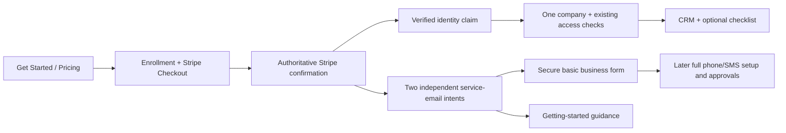

# Fundlane Stripe-first onboarding design

**Status:** Written specification approved on October 1, 2026 at 22:29 UTC. The user explicitly directed planning and execution into a PR titled `auth-refractor`. Release, merge, manual production deployment, live trial/charge/email activity and provider configuration remain outside that coding authorization. The original conversational design was approved at 21:59 UTC.

**Source baseline:** `2d6b5ea4a2eb48fcf2f8857a6a578c0c6ade48f3`, isolated local branch `codex/onboarding-stripe-first-design`. This includes PR #233's owner handoff and PR #234's repository tooling/documentation changes. No application code or hosted configuration was changed to produce this specification.

## 1. Outcome and settled decisions

New customers should reach useful CRM work through a short, familiar trial purchase. Existing customers need an unmistakable Login path. Business registration and optional setup should not delay otherwise authorized CRM access.

The public structure is:

**Login → existing-user authentication → the authorized destination**

**Get Started → pricing → Start 14-day free trial → Stripe Checkout → secure completion → CRM**

“Secure completion” is a brief handoff or recovery surface, not an account/company/seats setup wizard. A suitable existing authenticated session can complete it automatically. An anonymous customer must establish a verified identity after Checkout before protected CRM access. This necessary security distinction is described in section 5; the design does not claim anonymous payment authenticates the customer.

The user explicitly selected:

| Decision | Required behavior |
| --- | --- |
| Entry order | No mandatory Fundlane account registration, company form, or seat-selection wizard before Stripe. Login is separate from Get Started. |
| Trial | Exactly **14 days**, card collected upfront through Stripe, automatic paid subscription afterward unless canceled. Show the actual price and first charge date. |
| Pricing | Preserve existing Fundlane pricing, not MCA Pilot's price. Initial purchase is the existing base subscription including its first user. Additional seats are managed later inside the app. |
| Checkout information | Collect email and business name in Stripe. Prefill that name later; do not make the customer type it again unnecessarily. |
| CRM entry | Once identity, security, and authoritative trial entitlement permit access, enter the CRM immediately. Business-form completion, internal business review, team invitations, optional setup, and onboarding-email delivery are not CRM gates. |
| Business details | The initial secure form asks the customer to confirm/correct the prefilled legal business name and supply EIN. Remaining phone/SMS registration fields are collected when enabling those capabilities. |
| Email | Two distinct onboarding emails: business-information request and getting started. Their delivery is independent of CRM admission. |
| Communications | Preserve all internal review, provider registration, number, consent, suspension, and capability-specific prerequisites. Basic details alone do not unlock phone/SMS. |

These decisions supersede the earlier account/company/seats-first proposal and initial discovery's unanswered-decision language.

## 2. Evidence and limits

The parent reported a fresh public browser inspection at 21:57 UTC on October 1:

- MCA Pilot homepage Login opened `https://app.mcapilot.com/login`, with email/Next and Google and no signup link.
- Start free opened `https://mcapilot.com/pricing`; Start 15-day free trial opened the public Stripe-hosted checkout at `https://pay.mcapilot.com/b/cNibJ1fLkd5mcy6cRZ8Zq0e`.
- Visible Checkout fields included Email, Business name, payment methods, optional Link save-details/phone, and Start trial. No account registration preceded Checkout. No field was submitted during that inspection.
- The user's firsthand account supplies the subsequent high-level experience: Stripe, two emails, then app entry. MCA's post-Checkout identity/provisioning mechanism was not verified.

The parent's earlier authenticated inspection covered settings, senders, templates, and follow-ups; a canceled account prevented observation of normal deal work. The reported welcome email's own-address test guidance was provider-authored advice, not an executed successful submission. MCA's 15-day/$499 offer is reference evidence only. Fundlane uses the user-approved 14 days and its own prices.

Repository discovery establishes the current constraints: Checkout creation currently requires a workspace and owner; the callback returns to billing/team setup; verified Supabase identity is required for CRM; billing and SMS approval are separate; the requested email pair does not exist. This refactor changes those interfaces through an enrollment coordinator, rather than disguising anonymous users as verified accounts.

## 3. Public and in-app experience

### Login

Use **Login** consistently in desktop/mobile navigation and the public footer. The initial sign-in surface offers email/Next and Google. It does not contain a second self-service signup form. Email-first presentation continues through supported password or email authentication and required MFA without revealing whether an arbitrary email has an account. Google keeps the existing callback checks.

Ordinary login returns to the validated intended workspace/destination. Multiple memberships retain company selection. Platform-owner default entry and MFA continue to `/platform` as repaired by PR #233. A purchase never creates platform authority. Existing invitations and migrated-account recovery remain distinct routes, with their existing identity and matching-email requirements.

### Trial purchase

Get Started opens pricing. Its trial CTA opens Stripe immediately after a server-side enrollment/session request; there is no customer-facing intermediate registration or company/seats form. A loading state prevents accidental repeated clicks and a recoverable error keeps the customer on pricing when Checkout is unavailable.

Stripe collects the email, business name, and required payment method. The server selects the existing base price and quantity **1**; the browser cannot supply a price ID, arbitrary quantity, trial duration, customer ID, or subscription ID. No EIN is collected in Stripe. Preserve existing tax/discount behavior where configured; introduce no new discount, tax, refund, or cancellation policy through this refactor.

Before commitment, pricing and Checkout agree on a 14-day trial, recurring amount/currency/frequency, and automatic conversion unless canceled. Stripe presents the date applicable at completion; the app thereafter displays the authoritative `trial_end` as the first scheduled charge date, in a labeled timezone. Tax or another variable amount must be identified accurately rather than advertised as an invented exact total. A price/configuration mismatch stops new Checkout rather than showing a false offer.

### First CRM visit

After secure completion, open the normal authorized CRM home with a compact, dismissible, resumable getting-started checklist. No mandatory invitations, connections wizard, business-details modal, or forced test submission appears first. Show the trial end and a visible Plans & Billing/cancel path. The business-details task is available in-app even if its email is delayed or absent.

Use plain statuses: “Confirming your trial,” “Verify your email to open Fundlane,” “Your business details are saved,” and “Phone and SMS need additional setup.” Do not label queued mail delivered, saved business data verified, or a configured sender tested.

## 4. Architecture and ownership

Keep Next.js 16/React 19/TypeScript, Supabase Auth/Postgres/private Storage, the existing Stripe integration, `pg`, and Drizzle. Do not introduce a second authentication system, migration owner, payment catalog, or generic wizard engine.

| Unit | Responsibility and boundary |
| --- | --- |
| Enrollment coordinator | Owns anonymous purchase intent, server-selected offer, Checkout association, safe resumption, identity claim, and exactly-once local finalization. It does not decide platform roles or replace billing authorization. |
| Stripe adapter/reconciliation | Verifies the configured account/mode, expected Checkout session/customer/subscription, catalog and provider dates. Reuses billing policy, signed event receipts, retry infrastructure, and later workspace projections. |
| Identity/claim service | Uses verified Supabase identities, existing anti-takeover rules and required MFA to bind an enrollment. A browser resume token is not a CRM session. |
| Company finalization | Atomically creates one company, owner/membership, customer binding, billing projection, and SMS company for a valid new enrollment; retries return that same result. |
| Onboarding service-email outbox | Produces and dispatches the two independent enrollment-scoped messages, supports pre-company links, frozen content and receipt/uncertainty handling. |
| Business identity profile | Stores the legal name/EIN separately from complete SMS registration; serves the secure basic form and later supplies the communications profile. |
| Readiness presentation | Derives optional setup progress from existing company, sender, deal and submission facts; never controls core subscription access. |

New code should live in focused onboarding modules under the active application's `src/lib/mca/` and corresponding routes/components. Existing services remain the policy owners. The implementation plan will specify exact file decomposition and signatures after this spec is approved.

### Durable state

Add a dedicated enrollment record; do not create a fake owner, anonymous CRM identity, or ownerless normal company just to satisfy the old Checkout function. Its durable contract includes:

- Random enrollment ID, hashed high-entropy browser-resume secret, creation/update times, and version for concurrent changes.
- Offer/catalog version, price IDs, quantity, mode, trial policy version, and stable provider-request idempotency identity.
- Optional initiating verified identity; Checkout session/customer/subscription IDs as they become known; encrypted Checkout email and business-name snapshot; comparison hash where lookup is necessary.
- Separate Checkout, verified billing, identity-claim, finalization, and compensation/recovery states. Record provider trial dates once established; never compute a new trial end on resume.
- Claimed provider-user/local-user/workspace IDs, activation time, and sanitized failure/recovery reasons. Unique provider-ID and enrollment-to-workspace constraints enforce association.

Persist private business data in a versioned encrypted basic-profile record, and mail intents/delivery attempts in a separate durable outbox. Enrollment, billing, profile, and email state must not collapse into one `onboarded` boolean.

The diagram shows authority boundaries, not extra pre-Checkout screens. Email links can resume an unclaimed enrollment before a company exists; opening one still performs identity/claim authorization.

## 5. Secure identity and company linking

On the initial trial click, bind any suitable live verified session to the enrollment. Otherwise keep the enrollment anonymous and limited to purchase status/recovery. Set the resume secret in a Secure, HttpOnly, SameSite cookie; store only its hash. Status responses reveal only the minimum information warranted by that browser binding. Public IDs and Checkout query strings do not reveal email, business profile, membership, or CRM data.

After verified Checkout completion:

1. A bound session must still be live, verified, not banned/revoked, and satisfy applicable MFA. A session changing identities cannot silently take over the enrollment.
2. An anonymous enrollment offers post-Checkout email verification and Google. Use a dedicated enrollment-authorized Supabase email OTP/link path capable of creating a new provider identity; do not broaden the existing ordinary-login magic-link endpoint, which is existing-user-only and feature-gated. Do not require a new password or company form before Stripe. Password setup may remain an account-settings choice after entry.
3. A verified identity's normalized email must match the collected Checkout email for an anonymous claim. Matching the raw email alone is insufficient. Never auto-confirm an Auth user, mint a privileged session from Stripe data, or attach the purchase to an existing company by email/name.
4. Email mismatch or an incorrect Checkout address requires controlled recovery with independent proof of the intended identity and purchase, recorded by an authorized operator with step-up. No unauthenticated “change owner email” shortcut exists. An address correction must not merge existing provider identities.
5. Claim/finalization locks the enrollment and relevant owner/trial records, applies the existing user-linking and trial eligibility policies, and commits its local writes together. Unique constraints make concurrent claims converge on one result. A failed transaction leaves a recoverable enrollment and no partial tenant grant.

Extend the existing continuation allowlist narrowly for enrollment completion across email, Google, migration recovery and MFA. Preserve only an opaque enrollment locator and an allowed local destination; reject arbitrary return URLs and sensitive form values. The current signup-only OTP verification contract must not be mistaken for the new email-sign-in contract. Enrollment status reads must not invoke billing helpers that automatically resume paused trials.

For new companies, use the Checkout business name as the initial workspace display name, without claiming it is a verified legal identity. Initialize owner membership and SMS email-verification state only from the verified Auth identity. Select the company only after membership validation. Restore the intended business-form or getting-started destination after claim; an ordinary completion opens CRM.

Existing valid customers who are already identified should use their existing company rather than receive a new trial. Existing accounts with several companies retain the chooser; invitees retain the invite path. If a previously anonymous purchase resolves to an existing company or an ineligible prior trial, section 6 governs the new enrollment; do not overwrite an existing subscription or grant an extra trial.

**Identity limitation:** an anonymous Stripe purchase cannot always lead invisibly into an authenticated CRM while preserving Fundlane's verified-identity requirement. The design places only necessary authentication after Stripe, with safe resume and no setup wizard. A security verification email, when needed, is separate from the two nonblocking onboarding emails; Stripe receipts and existing billing/security notices may also exist. This is a Fundlane security design, not a claim about MCA's private internals.

## 6. Billing, eligibility, and asynchronous confirmation

New public trial sessions always request **14** days and required card collection. Stripe's resulting subscription dates are authoritative. Checkout abandonment before subscription creation does not start a local trial. Closing the return page, late verification, resending a link, changing a name, or retrying a webhook does not reset, extend, or restart the clock. Existing trials keep their original dates.

At this baseline the source catalog's base is **USD 399/month including the first user**, with existing graduated additional-seat pricing. Those values are preserved, but runtime display and Checkout must validate the actual configured matching price. Do not copy MCA's USD 499 price or 15-day duration. Do not apply the legacy no-card five-user trial to this new path. Missing required configuration fails closed with retry; it never silently grants a local trial.

A Checkout return requests server reconciliation and polls a bounded status endpoint while confirmation is pending. It never grants an entitlement itself. Signed Stripe events are recorded durably and reconciled against the provider. The new handler recognizes only server-created enrollment sessions before a workspace mapping exists; it cannot discard all unmapped customers as the current workspace-only path does. Validate session ownership, mode, expected offer, subscription/customer linkage, trial dates and payment-method outcome. Preserve the existing treatment of unpaid/incomplete/paused/canceled subscriptions and verified paid invoices after trial.

Webhook, return-page, and scheduled repair converge on one enrollment reconciliation service. External calls are not made inside the final company-creation transaction. Provider acceptance followed by a lost response is recovered using stable request IDs and provider reads before another create/cancel request. Event ordering, `checkout.session.completed`, or a zero-dollar invoice alone is not proof of all required access conditions.

### Trial-abuse adaptation and duplicate purchases

The existing owner-based reservation check requires identity before Checkout. An anonymous enrollment cannot truthfully pass that check. Adapt the boundary explicitly:

- Before Checkout, reserve the enrollment/session, rate-limit creation using existing shared rate-limit primitives, and apply any trustworthy known-owner restrictions. Anonymous reservation is provisional, not a trial grant or an invented owner identity.
- Before operational finalization, apply the existing enabled owner/email/domain/card-review policies under their proper locks, account for reservations and all provider trial history, and attribute accepted history to the verified claimant. Do not disable the abuse controls to make anonymous Checkout work.
- A 14-day CTA must never silently fall back to a no-trial immediate paid subscription when a customer is ineligible. Known ineligibility stops new trial Checkout and directs the authenticated customer to their existing billing/recovery path.
- If ineligibility or an existing active company is discovered only after anonymous Checkout, do not provision a second operational tenant or overwrite an existing subscription. Mark that enrollment blocked and promptly reconcile **only its newly created redundant trial subscription** for cancellation while it remains uncharged. This compensating action is durable, idempotent, auditable, and must verify the enrollment's exact provider ownership and current billing state. If discovery happens after conversion, an invoice/payment is already in progress, or cancellation is failed/uncertain, route to an urgent operator billing case; do not claim a charge was prevented, invent a refund policy, or label it canceled without confirmation. Existing subscriptions are untouched. This narrowly scoped compensation policy is part of the proposed written design for review.
- Duplicate events/retries for one enrollment reuse its company/session/subscription. Anonymous attempts from unrelated browsers cannot be globally identified as the same person before authentication; authenticated resolution catches those conflicts. Do not promise otherwise.

Unclaimed but otherwise valid trials keep the disclosed Stripe clock and renewal terms; the system does not silently extend or cancel them solely because verification is incomplete. A verified claimant can recover, see the actual first charge date, and cancel/manage that enrollment before company finalization through a narrowly scoped billing-recovery service. It validates the enrollment's customer/subscription; it does not broaden the existing company's general recovery allowlist. Migration-recovery and required MFA remain enforceable.

Preserve existing period-end cancellation, payment-method pause/recovery, grace, manual holds/extensions, tenant exemptions, tax behavior, immutable history, and seat-capacity/proration policies. This specification does not authorize refunds, price changes, trial-length changes to existing subscriptions, or new platform-wide billing settings.

## 7. Two service emails

Create two separate durable intents when Stripe trial activation for an enrollment has been authoritatively recorded. Both must be recoverable even if the browser never returns or no company exists yet. Use stable keys based on enrollment, activation/version and purpose, not Stripe event ID alone. Record activation and both intents atomically; a repair pass detects any interrupted legacy/transition case without duplicating them.

| Purpose | Initial subject and primary action | Required content |
| --- | --- | --- |
| `business_information_requested` | **Complete your Fundlane business details** → **Add business details** | Confirm/correct the name supplied at Checkout and add EIN in the secure form. Explain that phone/SMS require additional registration and approval. Explicitly say not to reply with EIN. |
| `getting_started` | **Get started with Fundlane** → **Open Fundlane** | Short optional sender/test/default/submission sequence, link to the in-app checklist, authoritative trial end and billing-management destination. Do not claim the business is verified or integrations are ready. |

The initial recipient is the Checkout contact address read from the verified session, used for transactional correspondence, not as proof of identity. After an authorized claim, link resolution checks the enrollment/company's current authorization. A business email address changing later never silently transfers ownership. Freeze recipient, template version, provider choice and content before first dispatch. Manual reissue after an authenticated address correction uses a new audited generation and invalidates superseded resume capabilities; it does not replay the original uncertain send.

Messages contain no EIN, authentication session, privileged customer-portal URL, or business-profile payload. Use an opaque enrollment locator and authentication-required destination. A GET from an email scanner must not consume a claim, create a company, or submit details. Links on another device can resume after normal verification; expired security credentials can be reissued without another trial.

Use an explicit service-email outbox rather than posing these messages as document/merchant notifications. Reuse the existing transport, encrypted frozen content, stable delivery keys, leases, claim fencing and outcome classification where appropriate. Its eligibility is verified enrollment activation and authorized lifecycle state, not an initiating tenant member's continued presence or operational CRM status. The two emails are service messages, not marketing subscription campaigns; do not inherit the unrelated notification unsubscribe footer or merchant suppression semantics. Provider bounces/complaints, invalid addresses and safety suppressions still stop inappropriate retries and expose recovery.

Each message independently records `queued`, `sending`, `retry`, `accepted`, `delivered`, `failed`, `uncertain`, or `suppressed`. Provider acceptance is not inbox delivery. Expired sending leases and lost/ambiguous provider responses become uncertain, requiring receipt reconciliation before any retry that could duplicate the send. Proven transient non-acceptance may retry using the same frozen content and key. Preserve the existing three-attempt, 15/30-minute retry policy where reused; do not invent indefinite resend loops or exactly-once delivery guarantees. Failure of one message does not erase or resend the other. No inbox ordering guarantee is made.

Dispatch through one explicitly owned service-email consumer integrated into the existing comms runtime, with a separate onboarding enablement gate and its existing bounded deadline. Enrollment/billing repair belongs with the existing billing maintenance ownership. Do not add a second billing schedule. Auth security email remains owned by Supabase's separately configured delivery path.

## 8. Progressive business information and communications

The secure basic form is reached from its email or the CRM checklist. Require a verified session, correct active membership, current company context, required MFA, integration permission and the existing admin/super_admin write authority. An email locator cannot select a foreign tenant or confer a role. Ordinary members see the next step/appropriate administrator message without EIN data.

The form contains legal business name, prefilled and editable, and EIN. Reuse existing name-length and EIN-format validation; normalize EIN for storage without treating valid formatting as authoritative business verification. A submitted state means “details supplied,” never “EIN verified” or “phone/SMS approved.” The basic profile remains separate from the current full `BusinessProfile`, which cannot accept only those two fields. Saving basics must not write a partial `sms_companies.profile_cipher` or set its review state to pending; existing review consumers require the complete profile.

Encrypt sensitive profile data with the existing AES-256-GCM/key-management approach and company-bound associated data. Do not place EIN in logs, audit payloads, errors, URLs, emails, analytics, diagnostics, browser storage, or Stripe metadata. After saving, show an EIN-present indicator and replacement action instead of echoing the full number in routine status responses. Audit actor, company, revision and changed field names, not sensitive values. Concurrent edits use a version check; a stale tab must not overwrite a later correction.

When enabling phone/SMS, prefill the complete registration form from this profile and request the remaining existing fields: business type, address, website, responsible contact, messaging purpose/samples, consent evidence, policy/terms references, and the applicable declarations. Validate the complete profile with existing provider prerequisites before submission. Basic profile updates can feed an unregistered draft; once provider registration locks identity fields, corrections follow the existing authorized operator process. Do not silently mutate an approved/registered identity or re-register an existing company.

Keep separate states for basic details supplied, full profile submitted, internal review pending/approved/rejected, provider registration, number readiness, SMS suspension, consent and budget. Phone search/purchase and sending remain server-gated on all applicable conditions. Platform review still requires actual platform grants, SMS approver authority and fresh step-up; a tenant role never creates that authority.

The form is optional for CRM entry but normally requires operational company access. During a billing pause, show billing recovery and preserve the form destination for afterward. Do not expose all Connections/SMS APIs as billing-recovery exceptions merely to support an email link.

## 9. Getting started and first useful work

Reuse the current setup/readiness services and relevant settings pages. Guide the customer through business basics, sender connection, an own-address test, default sender selection, and a test submission when its prerequisites exist. Team invitations, further intake/routing configuration and additional seats remain available as optional tasks inside the app.

Distinguish saved configuration, provider connection, verified sender, default chosen, test accepted, and confirmed receipt. A development preview or a saved sender must not mark delivery tested/live-ready. An own-address test must target an address the customer controls and explicitly confirms; do not use a real lender's address as a default test destination. Reuse sandbox or synthetic test records with clear labels where supported, and show the prerequisite when sender, documents or submission support is unavailable.

Opening an email or checklist never sends a test, creates a live funder/deal, purchases a number, submits documents, or invokes a provider. Each consequential action requires its ordinary explicit user action and existing approval/permission checks. Submission progress and Activity reflect authoritative send state; retry does not duplicate a prior submission. Dismissal hides guidance without fabricating completed facts.

## 10. Failure and recovery contract

| Condition | Required outcome |
| --- | --- |
| Repeated trial click or response lost after Stripe accepts session creation | One enrollment's stable request identity recovers/reuses the same compatible session; no second create while acceptance is uncertain. |
| Checkout canceled/open/expired | No CRM grant from navigation. Resume the open session or create a replacement only after verified expiration; do not start a local trial. |
| Successful Checkout, browser closed, webhook early/late | Durable activation, two mail intents and resumable claim remain available. Return and maintenance converge on the same record. |
| Duplicate/out-of-order event or unavailable Stripe read | No stale entitlement overwrite. Retry reconciliation; retain prior verified state and enforce local expiry. |
| Missing/expired resume cookie; another device | Authenticate the claimant; resolve eligible enrollment without exposing account existence or using the session ID as a bearer login. |
| Wrong account, unverified/banned/revoked identity, or insufficient MFA | No company grant. Offer correct verification/account-switch/recovery with the enrollment retained. |
| Database finalization failure or competing claims | Roll back partial writes; unique constraints and locks retain one winning company/claim. A retry returns that result. |
| Existing paid company or ineligible second trial discovered | Do not overwrite its billing or restart trial history. Reconcile the new redundant enrollment using section 6's compensation policy. |
| Wrong Checkout email | No automatic identity reassignment. Controlled, audited recovery; show actual trial clock and available support. |
| One onboarding email fails or remains uncertain | CRM eligibility unchanged, other email unaffected, receipt-based recovery exposed. |
| Basic form fails validation or loses connection | Field errors preserve nonsensitive input; safely retry using the same company/revision. Do not persist EIN in client storage. |
| Basic form submitted twice or full registration already exists | Idempotent/versioned update or protected correction route; no duplicate review/registration. |
| Trial expires or payment/cancellation state changes during setup | Existing billing access/recovery rules take effect; setup cannot restore operational access or replay old outbound approvals. |
| Consumer disabled or scheduler absent | Durable work remains visible with meaningful age/error state; do not claim messages were sent or delivery is healthy. |

All customer-facing errors distinguish retryable provider confirmation, authentication, billing recovery, and operator intervention without exposing secrets or raw provider payloads. Keyboard focus, loading states, accessible field labels, mobile navigation, refresh/back and cross-tab behavior are part of acceptance, not polish deferred until release.

## 11. Compatibility, migration and rollout

Use additive Drizzle migrations for enrollment, service-email state and the basic profile, with explicit restricted-role grants, indexes, constraints and tenant/enrollment access boundaries. Allocate migration numbers against then-current main. Do not edit historical migrations or install a second migration framework.

Do not bulk mark existing companies incomplete, resend new-trial emails to them, reset trial dates, overwrite legal/provider profiles, create new owners, or remove exemptions/holds/extensions. Preserve users, memberships, owners, platform grants, TOTP factors/recovery codes, invitations, active-workspace validation, purchased seats, pending reductions, cancellations, balances, provider/customer IDs, encryption keys and trial-abuse history. Existing full business profiles can supply basic-profile status through an authorized projection; do not require customers to re-enter EIN.

Keep existing billing recovery and in-flight legacy Checkout paths working. Restrict the new self-service Get Started route with a dedicated rollout gate aligned with open-signup and required Stripe readiness. Old direct self-signup links may route to pricing for new self-service entry; invitation/recovery callbacks must keep their explicit purpose and token. Login always remains available. Do not expose a “14-day Stripe trial” CTA while falling back to no-card or invite-only behavior.

Disable new enrollment creation as the first rollback action. Continue servicing existing enrollments, claims, webhook reconciliation, billing recovery and committed email work. UI rollback must not abandon already-created Stripe subscriptions or undo provider history. Retain additive records for reconciliation; no destructive rollback or automated deletion of customer data is part of this design.

This is one coordinated onboarding subsystem with bounded components, not a general rewrite of CRM, settings, auth or billing. The implementation plan should deliver independently testable slices while retaining one end-to-end release gate. Graphify refresh is required after future code changes, not for this documentation-only change.

## 12. Acceptance and evidence

Each requirement below must have automated coverage where deterministic and a documented hosted check where provider behavior matters. Existing tests are anchors, not proof the new behavior already works.

| ID | Scenario and observable result |
| --- | --- |
| A01 | Desktop/mobile Login and Get Started are distinct. New customer reaches Stripe through pricing without Fundlane registration/company/seats forms; Login preserves existing destinations and does not create a company. |
| A02 | Stripe collects email/business name/card; one base seat, exact matching configured price, 14 days, automatic-conversion terms and first charge date are displayed consistently. Missing/mismatched configuration does not create a different offer. |
| A03 | Delay between opening and completing Checkout: no local trial starts while merely open; provider `trial_end - trial_start` equals `14 × 86400`. Delayed webhook/claim does not alter either date. |
| A04 | Forged return URL/session/customer/price/quantity/mode, unmapped event, wrong signature and stale provider snapshot cannot grant access or create a foreign association. |
| A05 | Double-click, concurrent tabs, session-create timeout, completed-before-local-response and duplicate/reordered events converge on one enrollment/session/subscription and one local company for that enrollment. |
| A06 | Browser closes before return; confirmed activation and both email intents still exist, and authenticated recovery opens the same workspace without another trial. |
| A07 | New email identity, existing password account and Google can securely claim after Checkout. Email string equality alone, banned/revoked sessions and user-editable metadata cannot claim. Expired links and cross-device recovery preserve enrollment. |
| A08 | Normal MFA, migrated-account recovery and platform-owner real MFA remain enforced. PR #233 owner default and explicit company intent regressions stay covered. |
| A09 | Known and newly discovered trial ineligibility never silently become immediate paid Checkout. Conflicting existing subscriptions are untouched; exact redundant enrollment compensation is idempotent and uncertainty stays visible. |
| A10 | Claim/finalization failure after each durable boundary and two competing claimants leave no partial membership/owner/customer grant. Retrying the winning identity returns the existing company. |
| A11 | Two distinct email intents appear once per accepted activation, including unclaimed enrollments. A seat change, renewal, migration, invite acceptance or ordinary login does not produce a new welcome pair. |
| A12 | Provider acceptance lost locally, expired lease, duplicate receipt, frozen retry and reissued corrected address cannot cause an unsafe resend or identity transfer. Each email's state remains independent. |
| A13 | CRM is usable despite missing basic profile or failed onboarding mail. A fresh anonymous customer still needs real identity verification; no payment-generated authentication bypass exists. |
| A14 | Business form prefill avoids retyping; legal-name correction and valid EIN save an encrypted basic profile without requiring the complete SMS profile. Response/audit/email/URL/telemetry/diagnostics contain no EIN. Stale revisions are rejected safely. |
| A15 | Foreign company locators, wrong active company, regular members, API keys and CSRF attempts cannot read/update the protected profile. A forwarded email does not grant membership. |
| A16 | Basic information complete, internal approval pending/rejected, carrier pending, suspension, unready number, missing consent and insufficient budget all preserve the applicable phone/SMS blocks. Full activation reuses the basic fields without re-registering an existing company. |
| A17 | Checklist distinguishes configured, preview, accepted and received outcomes. Tests use explicitly controlled recipients and do not auto-send/create/submit on page load or checklist completion. |
| A18 | Old/new tenant cohorts retain historical trial dates, prices, subscriptions, exemptions, owner/MFA access, invitations, seat capacity, registered SMS profiles and billing recovery. Rollback keeps pending enrollments serviceable. |
| A19 | Exact trial-boundary time, cancellation during setup, payment failure, provider outage and late reconciliation follow existing access rules; company pause does not erase setup or authorize replay of old outbound actions. |
| A20 | Scheduler absent/disabled, missing provider configuration, stalled queue and pending compensation generate actionable sanitized operational state; a successful empty cron response is not recorded as delivery evidence. |

Useful existing anchors: `tests/billing-onboarding.test.ts`, `billing-webhook-async.test.ts`, `billing.test.ts`, `billing-test-clock-acceptance.test.ts`, `supabase-auth.test.ts`, `supabase-auth-http.test.ts`, `auth-oauth-mfa.test.ts`, `platform-super-admin-auth.test.ts`, `invitation-profile-isolation.test.ts`, `company-ownership.test.ts`, `notifications.test.ts`, `transactional-email.test.ts`, `sms-onboarding.test.ts`, `workspace-setup-readiness.test.ts`, and sender/submission tests. The plan must map new scenarios to exact tests and interfaces; this spec does not substitute vague “test onboarding” tasks.

### Hosted proof and production activation

Use disposable PostgreSQL for deterministic database tests and an explicitly approved nonproduction Supabase/Stripe/email target with synthetic records for hosted acceptance. Preserve Node 24 and pnpm 11.1.2 project requirements. No production credentials/data or migrations belong in ordinary agent setup.

Before advertising the new flow as working, collect evidence for real Checkout completion/abandonment, Auth verification/Google/MFA continuation, actual dates/prices, signed and delayed webhook reconciliation, company scoping, both controlled own-address onboarding sends, provider receipt classification and interruption recovery. Mock success and a preview build alone are insufficient.

Read `docs/background-job-runtime.md` and `docs/ops/cron-schedules.json`, then verify actual scheduler owner, enabled flags, code revision, queue claims and last useful work. The documented billing schedule's 144/144 successes is historical evidence, not permission to install a duplicate or proof of these emails. The private-email consumer does not run the reminder producer. Absence of a platform-monitor Edge function alone is not an outage: another host may own that consumer. Establish actual ownership before any installation.

Use one billing/enrollment-repair owner and one comms/service-email consumer; verify there is no competing legacy worker. Prove provider authentication, deduplication and accepted/uncertain/receipt handling with controlled recipients, including one killed or timed-out send. Record actual received-message evidence where claiming delivery. Verify Supabase security-email delivery separately. If a required runtime/provider capability is unproven, leave public activation disabled and state that precise acceptance gap.

This document authorizes none of those external sends, schedules, migrations, releases or billing changes. They require the implementation/release approvals and explicitly approved test environment at their respective stages.

## 13. Source references

Repository links are pinned to this specification's baseline; execution must recheck relevant changes before implementation planning:

- [Repository instructions](https://github.com/mbelenkiy29/fundlane/blob/2d6b5ea4a2eb48fcf2f8857a6a578c0c6ade48f3/AGENTS.md) and [task isolation](https://github.com/mbelenkiy29/fundlane/blob/2d6b5ea4a2eb48fcf2f8857a6a578c0c6ade48f3/nextjs-version/docs/agent-task-workflow.md).
- [Company onboarding UI](https://github.com/mbelenkiy29/fundlane/blob/2d6b5ea4a2eb48fcf2f8857a6a578c0c6ade48f3/nextjs-version/src/components/mca/auth/company-onboarding.tsx), [identity and provisioning](https://github.com/mbelenkiy29/fundlane/blob/2d6b5ea4a2eb48fcf2f8857a6a578c0c6ade48f3/nextjs-version/src/lib/mca/supabase-auth.ts), and [merged owner handoff PR #233](https://github.com/mbelenkiy29/fundlane/pull/233).
- [Billing service](https://github.com/mbelenkiy29/fundlane/blob/2d6b5ea4a2eb48fcf2f8857a6a578c0c6ade48f3/nextjs-version/src/lib/mca/billing.ts), [trial-abuse contract](https://github.com/mbelenkiy29/fundlane/blob/2d6b5ea4a2eb48fcf2f8857a6a578c0c6ade48f3/nextjs-version/src/lib/mca/trial-abuse.ts), and [existing catalog](https://github.com/mbelenkiy29/fundlane/blob/2d6b5ea4a2eb48fcf2f8857a6a578c0c6ade48f3/nextjs-version/src/lib/mca/billing-catalog.ts).
- [Notifications](https://github.com/mbelenkiy29/fundlane/tree/2d6b5ea4a2eb48fcf2f8857a6a578c0c6ade48f3/nextjs-version/src/lib/mca/notifications), [SMS onboarding](https://github.com/mbelenkiy29/fundlane/blob/2d6b5ea4a2eb48fcf2f8857a6a578c0c6ade48f3/nextjs-version/src/lib/mca/sms/onboarding.ts), and [setup readiness](https://github.com/mbelenkiy29/fundlane/tree/2d6b5ea4a2eb48fcf2f8857a6a578c0c6ade48f3/nextjs-version/src/lib/mca/setup).
- [Runtime inventory](https://github.com/mbelenkiy29/fundlane/blob/2d6b5ea4a2eb48fcf2f8857a6a578c0c6ade48f3/nextjs-version/docs/background-job-runtime.md) and [schedule manifest](https://github.com/mbelenkiy29/fundlane/blob/2d6b5ea4a2eb48fcf2f8857a6a578c0c6ade48f3/nextjs-version/docs/ops/cron-schedules.json). Configuration describes intent, not authenticated tool access or live execution.
- [MIC-151](https://linear.app/michael-belenkiy/issue/MIC-151/workspace-onboarding-checklist-and-contextual-support), read as Backlog during discovery: related readiness/diagnostics context, not an assignment or proof of completion.
- Stripe primary documentation: [hosted Checkout trials](https://docs.stripe.com/payments/checkout/free-trials?payment-ui=stripe-hosted), [fulfillment and browser/webhook convergence](https://docs.stripe.com/checkout/fulfillment?payment-ui=stripe-hosted), and [webhook ordering/retries](https://docs.stripe.com/webhooks#event-delivery-behaviors). These support server confirmation and idempotent fulfillment, not a claim that deployment has been verified.
- Supabase primary documentation: [email OTP/sign-in](https://supabase.com/docs/reference/javascript/auth-signinwithotp). An enrollment-authorized new-user path and the correct provider template/callback behavior require implementation and hosted acceptance; the current existing-user magic-link route is not already that feature.

## 14. Written-spec review gate

This is a proposed architectural specification, not an executable implementation plan. Review the chosen behavior, including the unavoidable post-Checkout identity boundary and narrowly scoped duplicate-trial compensation. Inline self-review completed: placeholders, internal consistency, scope and ambiguity checked; the authentication continuation, partial SMS-profile boundary and late duplicate-purchase recovery were clarified. Source cross-check and local reference validation support this document; no application or hosted acceptance tests were run for this documentation-only change.

After the user approves this written spec, invoke Superpowers writing-plans to produce exact files, interfaces, regression tests, migrations, verification commands and task boundaries. The user must then review that plan and select an execution method. No implementation, PR, merge, deployment, provider activation or billing operation is approved merely by receiving this document.
