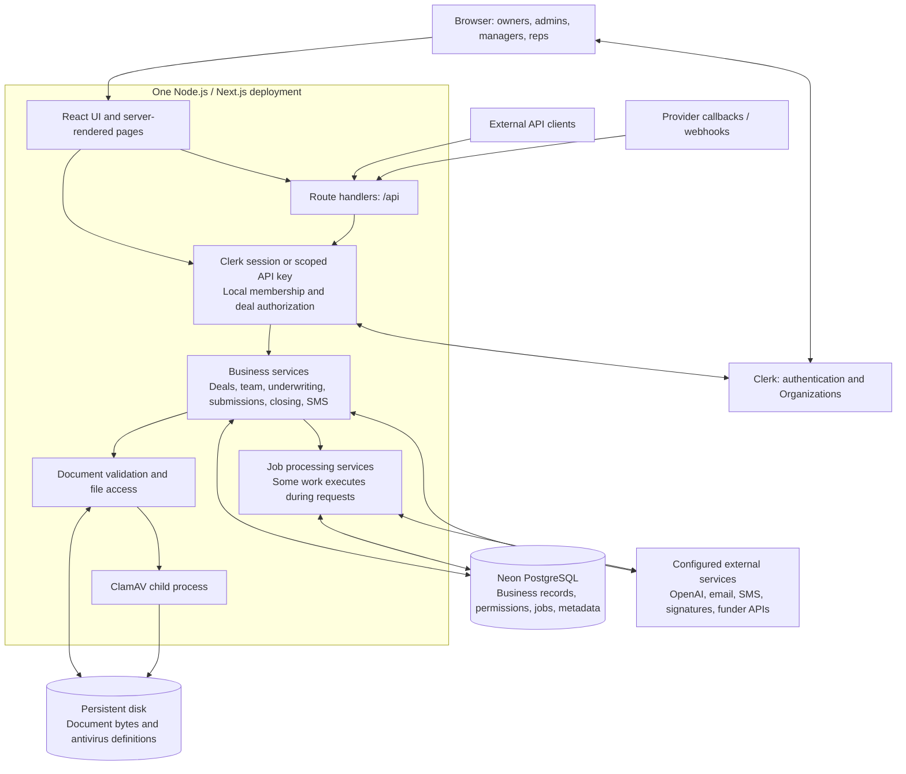
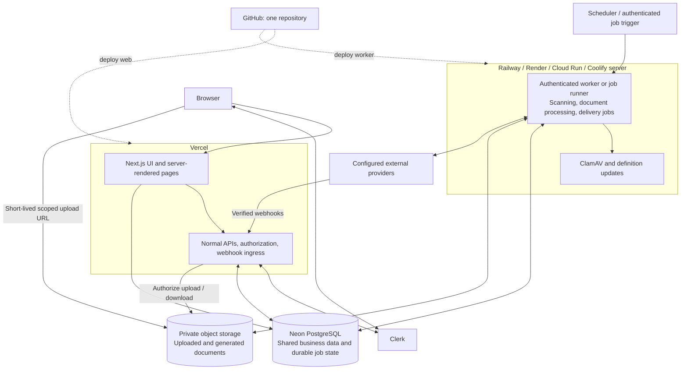

> Historical architecture assessment. Current hosting is Vercel with Supabase Postgres/Auth/Storage. See [the live Render dependency audit](docs/render-deployment.md) for retained workers and known processing gaps; the Neon/Clerk and single-container recommendations below are not current deployment instructions.

# MCA / Fundlane architecture and hosting brief

Prepared September 2026 from the local application source. This describes the checked-in-style workspace implementation, not a fresh audit of what is currently deployed at the live URL. Authentication cutover and provider activation can differ between development and production.

## At a glance

MCA is a multi-company merchant cash advance CRM. It manages deals, documents, underwriting, funder submissions, offers, closing, communication, and team access.

**The current app is one fullstack Next.js application.** Its React interface, server-rendered pages, HTTP APIs, business services, document processing, and job runners share a codebase. There is no separately packaged backend or continuously running queue worker in the supplied production startup command.

| Layer | Current implementation |
| --- | --- |
| UI | React 19, TypeScript, Tailwind CSS 4, shadcn/Radix components |
| Web application and backend | Next.js 16.1.1 App Router, Node.js 24+ |
| Business services | Server-only TypeScript modules under `src/lib/mca/` |
| Database | Neon PostgreSQL; `pg` connection pool, SQL repositories, Drizzle schema/migrations |
| Authentication | Clerk custom login/signup flows and Organizations; MCA permissions stored in Neon |
| Company subscriptions | Clerk Billing with Stripe; development-only catalog |
| Document bytes | Local filesystem; persistent `/data/documents` in the Docker deployment |
| Malware scanning | ClamAV executable launched by the Node process; signatures under `/data/clamav` |
| Durable job state | PostgreSQL records; processing through services and job-run HTTP routes |
| Deployment configuration | Docker standalone Next.js build, Railway configuration, persistent `/data` volume |
| Source control target | GitHub; hosting services can deploy from the same repository |

## 1. Current application architecture

The diagram groups dependencies for readability. Webhooks use their own provider-specific verification and reconciliation paths, rather than a browser login requirement. Provider support in source does not establish that credentials, approval, or live delivery are enabled.

## 2. Data ownership and access

- **Neon owns application data:** users mapped to Clerk IDs, companies/workspaces, memberships, four MCA roles, manager relationships, deal ownership, financial records, submission history, audit events, job state, and document metadata.
- **Clerk owns browser identity and Organization identity.** Access also requires an active local MCA membership. Clerk Organization membership alone does not grant business access.
- **The filesystem owns document bytes.** A database backup alone cannot restore uploaded files.
- **Clerk Billing owns subscription state; Neon enforces local seat reservations.** Billing status does not replace company review or SMS approval.
- Sensitive deal fields use AES-256-GCM with the workspace ID as authenticated data. Preserve `MCA_DATA_ENCRYPTION_KEY` during any move; changing it without a deliberate re-encryption process prevents reading existing encrypted data.
- Reps see permitted owned deals; managers can see their permitted team deals; Admin/Super Admin access remains workspace-scoped. Financial restrictions are enforced server-side.
- API clients use MCA API keys with scopes. Database credentials and provider secrets must remain on trusted servers, never in browser code.

## 3. Important request and processing flows

### Normal application request

1. User authenticates with Clerk.
2. A server-rendered page or API route resolves identity, selected company, and local membership.
3. The business service enforces role, workspace, deal, and financial visibility rules.
4. A repository reads/writes Neon and returns permitted data.

Server components can call services directly. The frontend is not currently a static SPA that obtains all data from a separate backend URL.

### Document handling

Document services use filesystem storage and a local ClamAV subprocess. The scanner writes temporary files, runs the executable, and removes its temporary files. The production startup script refreshes antivirus definitions and starts the updater. Preserve document immutability, validation, tenant access, and scan failure behavior when changing storage.

### Jobs and external delivery

Job records provide durable state, but a stored job is not automatically an independently scheduled worker. For example, submission creation can call delivery immediately after saving a job. Other modules expose run endpoints for intake attachments, receipts, communications, replies, SMS, and accounting schedules.

A hosting move must inventory each job's trigger, authorization, timeout, retry, and concurrency rules. The Docker startup currently launches the Next.js server plus the antivirus updater; it does not launch a separate general-purpose worker daemon. Redis is not a current required dependency.

### External integrations

| Integration | Purpose / qualification |
| --- | --- |
| Clerk | Authentication, Organizations, invitations, signed event reconciliation |
| Clerk Billing / Stripe | Company subscriptions and payment processing; live activation is separate |
| OpenAI Responses API | Configurable bank-statement extraction; requires provider/model credentials |
| Postmark / useSend / configured email gateway | Different inbound/outbound email paths; configuration varies by workflow |
| Twilio and other SMS adapters | SMS onboarding and messaging; provider/carrier activation required |
| DocuSeal | Signature/closing and intake integration paths |
| DataMerch and funder adapters | Business checks and submission integrations; adapter existence does not imply live provider access |

Google Document AI is an alternative discussed for evaluation, not the currently implemented statement extraction provider.

## 4. Proposed Vercel + Neon + worker architecture

**This is a deployment target requiring implementation work, not the current deployment.**

Both deployments can build from the same GitHub repository. Business logic can remain shared. The worker should obtain job scope from trusted persisted data and recheck relevant authorization/state; it must not trust a browser-supplied workspace ID.

### Work required before this split

1. Add a private object-storage implementation of `DocumentStorage`; migrate existing bytes with checksum verification and preserve immutable object keys.
2. Add authorized direct uploads, a completion/validation handshake, and download authorization. Uploaded content must remain unavailable to normal use until required validation/scanning completes.
3. Move local executable and filesystem-dependent work out of Vercel routes. Audit document packaging, compression, extraction, uploads/downloads, and long provider calls, not only ClamAV.
4. Create explicit worker entrypoints, authenticated triggers, retry scheduling, job claims, and recovery after interruption. Preserve duplicate-send safeguards and existing side-effect rules.
5. Size database connection pools across web instances and workers; use pooled Neon connections for application traffic.
6. Configure the same environment-specific Clerk identity mapping and required encryption key, with least-privilege provider credentials per service.
7. Add compatible web/worker release sequencing and run migrations once in a controlled release step.
8. Verify tenant isolation, upload authorization, failure recovery, delayed webhooks, and duplicate processing before cutover.

Vercel runs Next.js server code as well as the UI. Its Function request/response payload limit means large document transfers need an alternate path. See [Next.js on Vercel](https://vercel.com/docs/frameworks/full-stack/nextjs) and [Function limits](https://vercel.com/docs/functions/limitations).

## 5. Simpler hosting alternative

Keep the existing fullstack container together on Railway, Render, a VPS managed by Coolify, or another Docker host; retain Neon and mount persistent document storage. This avoids splitting server-rendered pages from business services and is closest to the current deployment configuration.

Local volumes belong to a server. Adding replicas on another server does not automatically give them access to the same documents. Move to shared object storage or design an appropriate shared-storage strategy before scaling across hosts.

## 6. Requirements to give a hosting provider

| Requirement | What to ask for |
| --- | --- |
| Runtime | Linux Docker / Node.js 24+, or native Next.js support plus a separate Linux worker |
| Build | pnpm install with lockfile; Next.js build; adequate build memory; public Clerk key available at build time |
| Web serving | HTTPS, custom domain, configurable port, health checks, deployment logs |
| Database connectivity | Outbound PostgreSQL with verified TLS; bounded connection pools; preferably near the database region |
| Files, current architecture | Durable mounted storage for `/data/documents` and antivirus definitions; separate backups |
| Files, split architecture | Private object storage, scoped upload/download access, immutable writes, migration tooling |
| Scanner | Ability to run ClamAV executables, write temporary files, and refresh definitions |
| Processing | Explicit job runner/scheduler support and sufficient time/memory for document and provider operations |
| Networking | Outbound HTTPS to configured providers; public HTTPS webhook ingress |
| Secrets | Runtime secret store; separate development/production credentials; encryption-key retention |
| Recovery | PostgreSQL restore, document restore, secret recovery, and tested restore procedures |
| Scaling | Explicit limits for CPU/RAM, concurrency, database connections, uploads, request duration, disk, and egress |

An 8 GB VPS is a planning starting point for a combined small deployment, not a measured minimum. On managed platforms, size the web and scanner separately. The current project has no capacity benchmark that guarantees a particular employee count or monthly bill.

## 7. Source map and release notes

Paths are relative to this document's directory (`nextjs-version/`).

| Concern | Source |
| --- | --- |
| Dependencies / commands | [package.json](package.json) |
| Container and persistent paths | [Dockerfile](Dockerfile), [startup script](scripts/railway/start.sh), [railway.json](railway.json) |
| Pages and API handlers | `src/app/`, `src/app/api/` |
| Shared UI | `src/components/mca/`, `src/components/ui/` |
| Identity and permissions | `src/proxy.ts`, `src/lib/mca/auth.ts`, `clerk-auth.ts`, `policy.ts`, `deals/access-policy.ts` |
| Database pool / transactions | [db.ts](src/lib/mca/db.ts), `src/lib/mca/db/schema.ts`, `drizzle/` |
| Document bytes and scanner | [storage.ts](src/lib/mca/documents/storage.ts), [scanner.ts](src/lib/mca/documents/scanner.ts) |
| Submission delivery | `src/lib/mca/submissions/queue.ts`, `outbox.ts`, `repository.ts` |
| AI extraction | `src/lib/mca/underwriting/statement-extraction.ts` |
| Clerk release requirements | [Authentication](docs/clerk-auth.md), [Billing](docs/clerk-billing.md) |
| Production cutover record | [Railway cutover](docs/acceptance/railway-clerk-cutover.md) |

This document does not authorize a production migration or assert completion of the pending Clerk production cutover. Confirm the release record and actual deployment state before moving traffic. GitHub is the requested source-control destination; this architecture document does not create a repository or connect deployment pipelines.

For implementation changes, run relevant tests plus `pnpm typecheck`, `pnpm lint`, and `pnpm build`. Database verification must use isolated Neon test data. Preserve the database, document bytes, encryption key, and provider identity mappings together during any migration.
