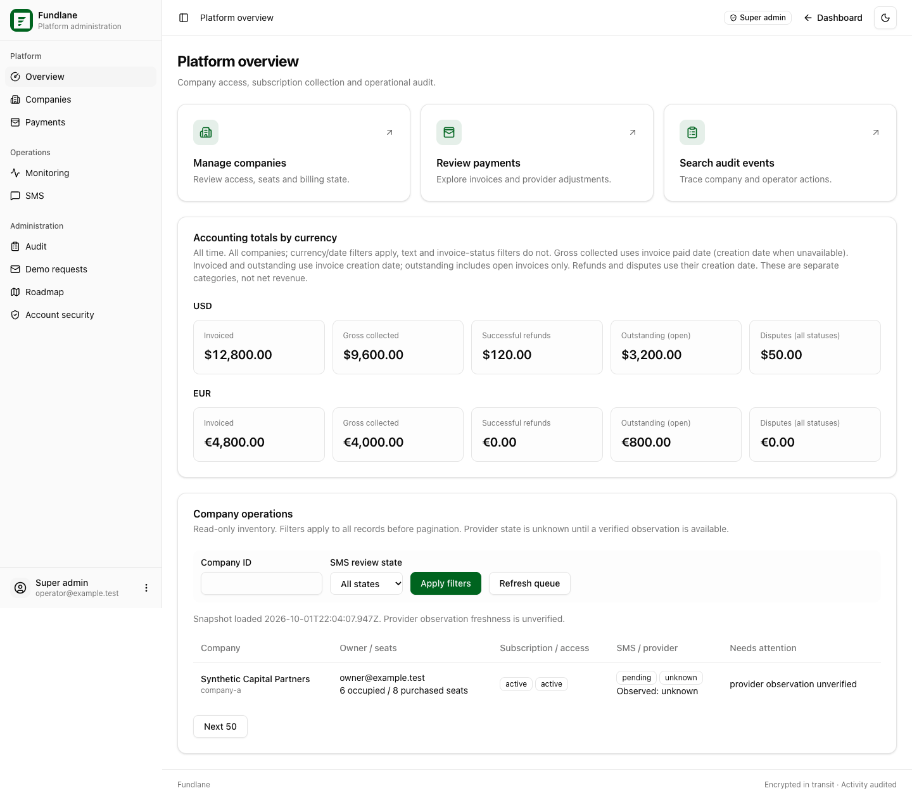
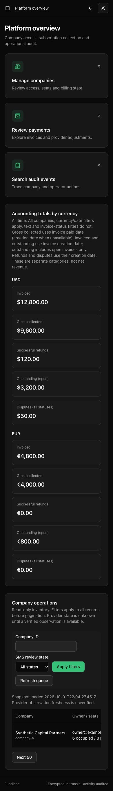

# Super admin dashboard redesign — October 1, 2026

The `/platform` portal uses the same shadcn sidebar, theme controls, typography, cards and tables as the user dashboard. Platform navigation and account links remain independent of company membership. The authorized server actor supplies the displayed operator email.

Overview, Companies and company details, Payments, Monitoring, SMS inventory and review, both Audit views, Demo requests, and conditional Roadmap pages received the redesign. Existing URLs, filters, pagination, API contracts, guards, required audit reasons, authenticator step-up and action confirmations remain in place. Financial cards keep every currency separate and retain their accounting definitions. No schema migration, new dependency or provider activation is required.

## Verification

- `pnpm typecheck`: passed.
- `pnpm lint`: passed; 16 existing warnings outside the changed code.
- `pnpm build`: passed.
- 62 targeted Node tests passed using a fresh disposable PostgreSQL 16 container on loopback port 55439. The test harness created/dropped isolated databases. Suites: `platform-super-admin-auth`, `platform-auth`, `platform-owner-parity`, `platform-controls`, `platform-queue-ui`, `platform-queue-page`, `status-dashboard`, `platform-status`, `platform-routes`, `platform-console`, `platform-queues`, `platform-shell`, and `public-roadmap-route`.
- Browser verification: all 11 screens at 1440 and 390 pixels, in light and dark themes (44 combinations), with no runtime errors or page overflow. Actual page and client components were bundled using synthetic service fixtures and lightweight Next router/link substitutes.
- Browser interactions passed: mobile drawer and same-route dismissal, sidebar collapse, platform account links, conditional Roadmap navigation, required audit reason, company access action, cancelled notification resend, search and pagination, queue refresh/stale snapshot, audit step-up and retained tab filters, SMS step-up/save/empty/error states, Roadmap publication, keyboard access, theme toggle and loading/error displays.
- `graphify update .` and `GRAPHIFY_VIZ_NODE_LIMIT=20000 graphify cluster-only . --no-label`: completed. Generated graph/report/HTML are refreshed locally and excluded from the implementation PR.

Reproduce the browser checks using [the harness instructions](../../tests/browser/platform/README.md). The runner writes screenshots and a JSON report to ignored `output/playwright/platform-redesign/`.

An additional run of the unchanged `public-roadmap-page.test.mjs` fails because its `next/navigation` mock does not expose `notFound` with this Node runtime. Its test, public page and imported services are unchanged; the platform Roadmap route tests and browser publication check passed.

## Remaining hosted acceptance

These fixtures do not establish real Supabase session behavior or Vercel preview readiness. Before release, review both granted owners on an approved nonproduction preview with synthetic records, including direct-page denial without a grant/MFA and SMS/audit step-up. Review existing company action and financial records with the same preview. No hosted credentials, production data, external notifications or provider mutations were used for this task.

## Synthetic screenshots

