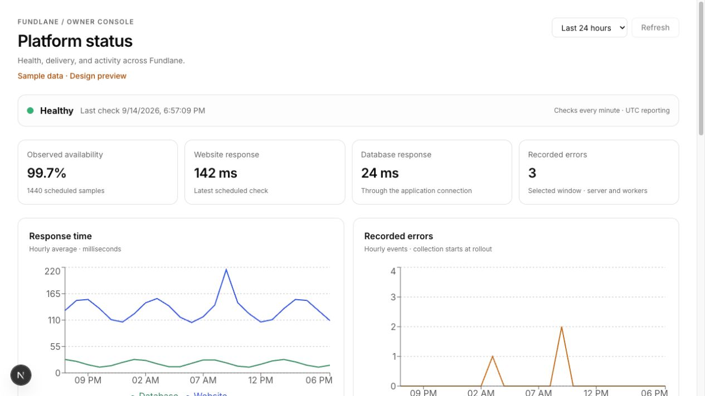
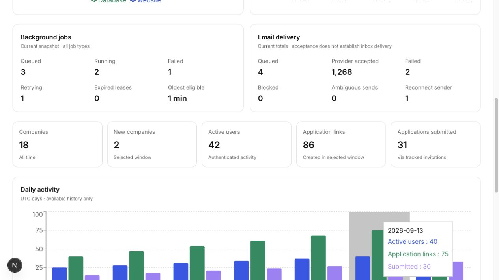
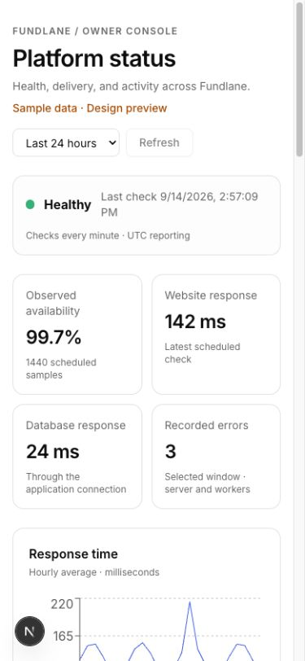

# Platform status acceptance

The images below show the actual dashboard component with explicitly labeled synthetic sample data. The temporary preview route was removed before committing. These images do not represent production metrics.

Verified locally: owner/role/session boundary tests, direct HTTP handlers, invalid filters and pagination, real Postgres metric queries, single-minute and overlapping invocation guards, outage/recovery/reminder transitions, ambiguous and interrupted alert sends, disabled-alert recovery, telemetry redaction/failure containment, and 30-day retention. Related email and Supabase session suites also pass. TypeScript, ESLint (existing unrelated warnings only), the Next.js production build, and the original Deno entry-point typecheck pass.

Not activated in production: the owner login and alert/test recipient have not been supplied. Production migration, Vercel/Supabase secrets, live function/database acceptance, schedule activation, and an actual opening/recovery email test remain release prerequisites documented in `../../platform-status.md`. No production delivery claims are made. No DNS records, existing schedules, or worker hosting have been changed by this PR.
