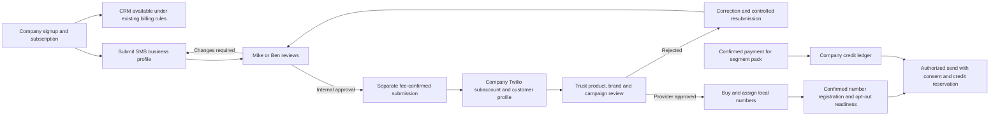

# Fundlane owner portal — design brief for Mike and Ben

**Review draft, October 1, 2026. Execution has not started.** Mike authorized drafting this design and the implementation plan now, with unresolved choices exposed rather than guessed. Approval of this document does not create accounts, charge money, send messages, deploy code or grant implementation permission.

## The proposed outcome

Give Mike and Ben one owner portal at `/platform` to oversee customer companies, review SMS onboarding, track provider approvals, diagnose failures, and manage the commercial and support operations needed for launch. Extend the existing platform console, monitoring, TOTP, audit and Twilio integration. Do not create a second application or a second authorization system.

The full v1 has three delivery slices: **owner operations**, **SMS onboarding and multiple numbers**, and **prepaid company SMS credits**. Audited sensitive support access is a gated capability within owner operations. The slices can be reviewed separately; finishing the first slice does not mean SMS commerce is launch-ready.

## Confirmed requirements

1. Mike and Ben have equal platform-owner permissions. Customer company roles never grant platform access.
2. Each company manages its employees within purchased seats. Owners oversee tenants without bypassing tenant isolation.
3. V1 SMS serves the US only, for updates and conversations about an existing application.
4. Companies pay through Fundlane and submit business information; Mike or Ben reviews it. Fundlane manages a company Twilio subaccount and offers number and credit purchasing inside Fundlane.
5. Paid companies can use CRM/application tools while SMS review is pending. SMS and number purchase remain locked.
6. Internal approval and Submit to Twilio are separate actions. Show the registration charge before submission.
7. Multiple local numbers, including employee assignments, are required in v1.
8. Customers buy SMS segment packs. Show required credits before sending. One company balance serves all its employees and numbers.
9. Operational details are visible to owners by default. Private deals, documents and message content require an explicit audited support-access action.

## Evidence and reuse

The [discovery record](2026-10-01-owner-portal-discovery.md) contains the detailed map and original interview answers. Source was inspected at `594679dad98c5c28af9794787c476ccf496e2c6c`. GitHub main was refreshed to `4bc1894f37080be5f0230f10921b34c7d463eea0` while writing this brief; the intervening #216 changes concern merchant application forms and do not change the mapped platform/SMS services. The release checkout has since moved to its own validation branch; it was only read, never changed by this task.

| Reuse | Existing source under `nextjs-version/` | Design implication |
| --- | --- | --- |
| Platform grants, same-session MFA, TOTP step-up | `src/lib/mca/platform-auth.ts`, `platform-step-up.ts` | Extend; do not infer authority from a tenant `super_admin` role. |
| Append-only audit | `platform-audit.ts`, migration `0070_platform_super_admin.sql` | Record owner actions and sensitive reads with safe metadata. Local mutations and audit commit together. |
| Company/payment views and controls | `platform-console.ts`, `src/app/platform/`, `src/components/mca/platform/` | Retain existing subscription, seat, invoice and access behavior. |
| Error/health dashboard | `operations/{access,status,telemetry,monitor}.ts`, `/admin/status` | Reuse data and UI; replace the separate single-owner identity gate. |
| SMS business review/provisioning | `sms/{onboarding,provisioning,maintenance,registration-events}.ts` | Extend the existing queues and checkpointed operations. |
| Registration/meter schema | `drizzle/0069_sms_company_provisioning.sql`, `db/sms-onboarding.ts` | Registration attempts and metering tables already exist; wire them deliberately instead of duplicating them. |
| Usage and billing patterns | `sms/managed.ts`, `sms/maintenance.ts`, `assistant/{credits,purchases}.ts` | Reuse transaction/idempotency patterns; AI credits remain a separate product and balance. |
| Safe recovery | `operations/job-recovery.ts` | Internal replay allowlist; uncertain external effects require evidence and reconciliation. |

Known differences to address: SMS approval currently defaults to Mike only; monitoring permits one configured owner; managed SMS enforces one live shared company number; prepaid SMS segment packs are not implemented; registration may currently be marked active from a timed assumption. These are code findings, not production-state assertions.

## Approaches compared

| Approach | Benefit | Cost / limit |
| --- | --- | --- |
| **Extend `/platform` — recommended** | Reuses existing security, data and workflows; one owner navigation and consistent tenant selection. | Requires careful consolidation of `/admin/status` and `/settings/sms-review`; provider/credit work still needs domain changes. |
| Links-only owner home | Fast way to make existing screens discoverable. | Does not resolve permission differences, review queues, number ownership or SMS commerce. Useful first increment, insufficient final result. |
| Separate admin application | Separate deployment and UI lifecycle. | Additional auth, deployment, API and data-access surface with no demonstrated need for two owners. Defer unless operating scale warrants it. |

## Proposed v1 navigation and priorities

**P0 — owner operations:** overview with actionable queue counts; Companies with company/user/seat/subscription/provider status; SMS review queue; Monitoring with errors, incidents, stale workers and failed jobs; Payments and SMS balance/usage projections; Audit. Reuse Demo requests and Roadmap without expanding them.

**P0 — SMS enablement:** versioned business submission; approve/request changes/reject; separate charge-confirmed provider submission; per-resource registration status and rejection reasons; controlled resubmission; provider reconciliation; multiple local number inventory and assignments; STOP/consent gates; shared prepaid segment ledger and checkout.

**P1 within the full v1, blocked on policy:** owner user-support mutations and audited sensitive support access, alert delivery to both owners, commercial refund/chargeback and rental-lifecycle behavior. They must pass their decision gates before being called complete.

**Proposed later:** toll-free and international numbers, marketing/cold outreach, auto-recharge, additional platform-staff roles, broad impersonation, automatic customer incident announcements, custom ticketing, and a new observability vendor. Mike may change these priorities at review. US local/application-update scope is confirmed; the later list is a recommendation.

## Workflow and state model

Keep five independent facts visible: subscription entitlement, internal review, provider registration, number activation, and spendable SMS credits. A single green Approved label must not conceal missing prerequisites.

**Business submission:** reuse existing US form and encrypted profile storage. Capture an immutable submitted version and reviewer decision against that version; submitting edits invalidates prior approval for the changed version. Retain customer-visible correction guidance separately from private internal notes. Additional documents and sensitive EIN viewing are governed by D4 below. Creating a submission never creates provider resources.

**Provider submission:** proposed operator-only action for either Mike or Ben, after internal approval, the agreed payment prerequisite, fee authorization and fresh step-up. Show the fee, payer and submission version; reject stale confirmation. Persist one operation identity before calling Twilio. The normal tenant provisioning route must not bypass these gates, including its PATCH path that can currently advance operations. Existing paid companies retain CRM access when SMS is rejected or pending.

**Provider state:** reuse `sms_registrations` for customer profile, trust product, brand and campaign attempts. Store provider IDs, normalized/raw safe status, failure codes, encrypted rejection details and observation time. Keep internal decisions separate. Poll through the existing bounded SMS worker for resources without configured callbacks; do not invent a second scheduler. Verify event signatures and account/service/number ownership. Unknown or stale data stays unknown. Proposed launch requirement: provider evidence, not an elapsed-time assumption, establishes number activation; existing assumed-active rows require explicit migration review.

**Rejection/resubmission:** request corrections against a submitted version; never replace old provider identities/history or resubmit an unchanged rejected payload blindly. Recheck the applicable provider's editing rules and fees. Where an API correction is unsupported, show an operator Console action and evidence requirement. A lost creation response enters `needs_review`; automatic retry is permitted only after a read proves the external operation did not happen or the existing resource is recovered.

**Numbers:** one subaccount per company, multiple company-owned local numbers. Proposed assignment policy: a number is shared or assigned to one active member in the same company; reassignment preserves history and re-evaluates current access. Deactivating an employee removes their use immediately and leaves the number company-owned for admin reassignment. No automatic number release on employee departure. Final visibility/default-sender rules require D3.

**Credits:** a distinct company SMS account, immutable credit entries, purchase records and per-message reservations. Store integer segment quantities and integer payment minor units; do not mix these or borrow AI credit balances. Confirm Stripe payment and tenant/product/amount/currency/mode before granting a pack exactly once. Reserve credits atomically before dispatch; reuse the message's durable identity on retry. Unknown delivery retains the reservation until reconciliation; no duplicate debit or automatic resend. Provider acceptance is not delivery. D2 determines which outcomes become chargeable and whether incoming segments consume credits. No production price is invented here.

## Permissions and sensitive-data boundaries

This is the proposed permissions model for review. Confirmed equal access applies equally to Mike and Ben in every owner column.

| Capability | Mike / Ben | Company admin | Employee |
| --- | --- | --- | --- |
| Cross-company operational overview | Both, authenticated grant + MFA | No | No |
| Company staff and seat administration | Proposed explicit scoped support actions, D8 | Existing own-company permission/seat rules | Existing delegated tenant rules only |
| Internal SMS approval/rejection | Both; fresh step-up + reason + audit | Submit/correct own company | No |
| Submit registration to Twilio | Proposed both; fee authorization + step-up; D1 | View status; no bypass | No |
| Buy/release/assign company numbers | Proposed support oversight; D3/D8 | Own company, approved limits and payment | Use authorized numbers only |
| Buy segment packs | Read/reconcile; adjustments require separate action/policy | Own company; D2 | No by default, D2 |
| Private customer content | Explicit audited support grant; D5 | Existing deal/document permissions | Existing deal/document permissions |
| Read provider secrets | No UI exposure proposed | No | No |
| Grant new platform owners | Retain trusted operator runbook in v1 proposed | Never | Never |
| Audit export / material mutations | Fresh step-up, trusted Origin, rate limit, reason | No platform audit access | No |

Use `requireSuperAdmin` consistently for platform pages/APIs, including formerly single-owner monitoring. Preserve verified identity, live grant, revocation, session binding and MFA; widening the SMS approver ceiling does not create grants. Keep TOTP step-up default ten minutes for existing protected actions; proposed extension covers suspension/resume, spend limits, recovery, user changes, credit adjustments and support access. No silent grant creation or broadening of tenant APIs.

Support recommendation: read-only, single-company, reason-required, 15-minute access after fresh step-up; recheck grant/session/company on every read and audit every resource view. This is proposed under D5, not confirmed. Use explicit platform support endpoints and a `SupportReadContext`, not a fabricated customer membership or customer session cookie. Stream private documents through a checked endpoint so revocation applies to new requests. Previously delivered bytes cannot be revoked. No provider tokens, encryption keys or raw request/provider payloads enter browser responses, logs or audit metadata.

## Data changes proposed for review

| Entity | Reuse / minimal addition |
| --- | --- |
| Owner grants and audit | Reuse `platform_admin_grants`, `platform_admin_audit`, `platform_step_ups`; no new universal RBAC framework. |
| Business submissions | Reuse current encrypted draft/content fields. Add `sms_company_submissions` for immutable versions (`id`, workspace, version, encrypted profile, submitter/time, internal state, reviewer/time, private note and customer correction message). Provider operation links to submission ID. D4 controls additional evidence storage. |
| Registration attempts | Reuse `sms_registrations`; add submission association and last-observed time if absent. Keep resource-kind/attempt identity and provider status/error data. |
| Number ownership | Reuse `sms_numbers` and account/member routing. Replace the one-live-number-per-workspace index only after all readers/writers support multiple numbers. Add only assignment/default constraints actually required by D3. |
| SMS commerce | Add separate `sms_credit_accounts`, `sms_credit_entries`, `sms_credit_purchases`, `sms_credit_reservations`. Unique provider purchase/event identities; message-bound reservation and settlement; locked company balance. Existing `sms_usage` remains provider-cost accounting, not customer credits. No simultaneous SMS metered-overage billing. |
| Support access | Add `platform_support_sessions` only after D5; bind actor user/session, workspace, reason, allowed scope, expiry/revocation. Use existing audit for access events. |
| Telemetry/alerts | Reuse ops tables. Add tenant association only where a server-resolved workspace exists; do not guess tenants for global failures. If dual recipients are approved, add per-incident/per-recipient delivery identities so one success does not suppress the other. |

The implementation plan requires a schema-owner checkpoint before allocating migration numbers. Never edit historical migrations 0069/0070 or seed owner grants automatically.

## Decisions needed — only the affected work is blocked

Recommendations are proposals for Mike to approve or replace. Silence is not agreement.

| Gate | Decision and proposed direction | Blocks |
| --- | --- | --- |
| D1 | Who submits and pays registration; what counts as payment? Propose owner-only submission and explicit tenant fee authorization after a successful paid subscription; define trial/card-on-file handling separately. Confirm live parent account/primary profile setup and eligibility evidence without sharing secrets. | Provider-submission writes and live SMS activation; read-only queues can proceed after plan approval. |
| D2 | Segment pack sizes/prices/currency/tax, outgoing/incoming charging, failed/unknown settlement, expiry/refunds/chargebacks, rental collection, registration fees, insufficient balance and cancellation. Propose company-admin purchases, manual top-up, no silent recharge, separate rental price, reserved credits for uncertain sends. Exact commercial terms need approval. | Checkout, customer debits, rental billing and full SMS commerce launch. Pure ledger arithmetic can be implemented independently after plan approval. |
| D3 | Number caps, shared versus assigned access, one/multiple assigned numbers per employee, default sender and history on reassignment/deactivation. Propose company ownership, explicit reassignment, no automatic release, and current deal permission AND number permission. | Multi-number routing/assignment and associated migration. |
| D4 | Required business/evidence documents, full EIN access, reviewer checklist, corrections/resubmission charge acceptance and retention. Propose current form plus private opt-in evidence references; do not collect extra IDs by default. | Final review/correction mutation workflow, evidence storage and deletion. |
| D5 | Support read scope, read-only vs edits, customer consent/notice, duration and exports. Propose read-only, reason + fresh TOTP, 15 minutes, one company, individual resource audit, no impersonation or bulk export. | Sensitive support access. Operational projections stay usable. |
| D6 | Incident destination, addresses/channel, urgency and thresholds. Pending interview choice: immediate email to both owners is recommended. Reuse current thresholds initially; show delivery failures and stale monitoring. Confirm independent uptime fallback before promising outage alerts. | New alert delivery/recipient configuration, not monitoring UI. No messages sent by this planning task. |
| D7 | Data retention and holds: telemetry currently prunes at 30 days; business submissions/support events/financial ledger/audit need approved schedules and retention obligations. Propose no new purge until approved; existing company holds must be respected. | New automatic deletion/export retention policies; no perpetual-retention promise. |
| D8 | Exact owner user-management actions and emergency controls. Propose view memberships/seats, resend existing invites, scoped deactivate/reactivate with last-owner protection, audited owner recovery only with evidence; no global profile overwrite or password display. Confirm platform-grant changes remain a trusted runbook. | User-management mutations; company/user inventory can proceed. |
| D9 | Approve proposed v1 sequencing/later scope and choose future execution style. Recommendation: scoped Codex workers plus independent Codex reviewer per PR, limited parallelism below. | All implementation until Mike explicitly authorizes it. |

## Compliance and external acceptance

Fundlane approval is not Twilio/carrier approval. The official [ISV onboarding guide](https://www.twilio.com/docs/messaging/compliance/a2p-10dlc/onboarding-isv-api) distinguishes primary/secondary profiles, trust product, brand, campaign and number association. [Toll-free verification](https://www.twilio.com/docs/messaging/compliance/toll-free/console-onboarding) is separate; [country-specific number regulations](https://www.twilio.com/docs/phone-numbers/regulatory/faq) are separate again. Neither is silently included in a US-local v1.

Twilio's [US/Canada prohibited categories](https://help.twilio.com/articles/360045004974-Forbidden-Message-Categories-for-SMS-and-MMS-in-the-US-and-Canada) make the actual financial-business use case a launch gate. Existing application updates are not an exemption assumed by this plan. Written provider eligibility evidence must match the real Fundlane/customer workflow; rejected use cases stay disabled.

[Subaccount usage is billed to the parent balance](https://www.twilio.com/docs/iam/api/subaccounts), so customer credit packs are Fundlane's commercial ledger, not Twilio balances. Parent suspension can affect all tenants. [Segment billing](https://www.twilio.com/docs/glossary/what-sms-character-limit) depends on encoding/length. Use official [API-key scope](https://www.twilio.com/docs/iam/api-keys) and [webhook validation guidance](https://www.twilio.com/docs/usage/security). Existing credential encryption and per-company keys are reused. No credential creation or transmission is authorized now.

## Definition of done and release posture

Mike and Ben can reach the same portal and authorized controls; ordinary tenant admins cannot. A paid but unapproved company retains CRM and cannot acquire/send SMS. Every review/submission refers to an exact version and fee consent. Distinct provider failures produce actionable queues. Multiple numbers obey same-company assignment and current resource permissions. Paid packs credit one shared balance exactly once; concurrent sends cannot overspend; uncertain outcomes do not create duplicate messages or purchases. Support access expires/revokes and logs sensitive reads. Missing telemetry never reports healthy. Each release has scoped tests, independent review, migration evidence and a reversible activation plan.

Use disposable local PostgreSQL and mocked providers for development. Later hosted acceptance requires a separately approved nonproduction Supabase/Vercel target, synthetic users/data, and explicit authorization for paid Twilio resources, Stripe activity or test messages. Source tests do not prove live carrier approval. Rollout starts with owner read-only surfaces, then reviewed mutations, then a designated pilot company. Stop/disable new sends or purchases without disabling signature-validated inbound/status callbacks or losing balances, audit, provider receipts or pending operations.

**Review requested:** approve or amend the architecture and D1–D9 choices. The accompanying plan is reviewable now; blocked tasks are deliberately not executable until their decisions are recorded. No implementation has begun.
